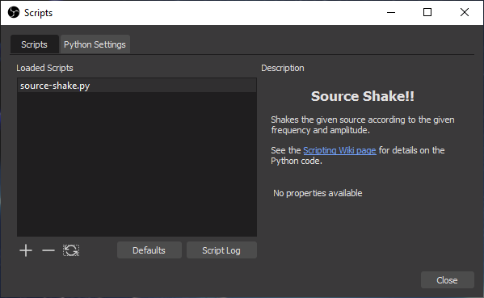
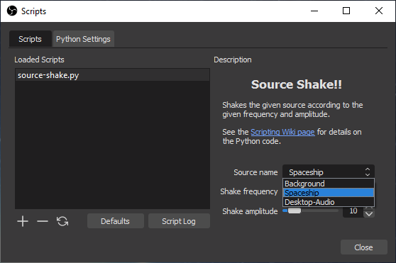

OBS can be extended with Python and Lua scripts. This guide explains the basics to get started and describes how to implement common features.

## Introduction

### Scripting in the OBS ecosystem

Before digging into the details, it is useful to understand the context.

Scripting is a way to add functionality to OBS but it is not the only one, and it is important to know how far it fit the environment before starting to learn a new API and possibly a new language. Namely, here is a non-exhaustive list of methods one could use to develop new functions that interact with OBS:

- [*Plugins*](https://obsproject.com/docs/plugins.html) are typically implemented in C/C++ and compiled into dynamic libraries that are discovered and loaded at run time by OBS. The main advantages of plugins are obviously the performance and the raw access to all functions and libraries of OBS. A significant drawback is the need to setup an OBS compilation environment and to deal with subsequent OBS versions if re-compilation is necessary. In addition, if a wide distribution is envisaged, compilation and installation for different platforms must be considered.
- [*Scripts*](https://obsproject.com/docs/scripting.html) are written in Lua or Python and are interpreted or compiled on-the-fly at run time. Scripts are mostly platform-independent and are usually not affected by slight changes of OBS data structures. They have access to large portions of the OBS C API through bindings. Obvious advantages are the simplified development and maintenance while supporting many features of plugins. The drawback is a lower performance, which is not an issue in most cases.
- [*Browser docks and sources*](https://github.com/obsproject/obs-browser) (for Windows and macOS) can use a small [Javascript API](https://github.com/obsproject/obs-browser#js-bindings) to react to events in OBS and retrieve basic information. They can be hosted on a web-server or locally, and support what Chromium supports (including HTML5, WebGL, etc). They are typically used as sources for overlays reacting to events.
- [*WebSockets*](https://github.com/Palakis/obs-websocket) can be used to remotely control OBS via a [network interface](https://github.com/Palakis/obs-websocket/blob/4.x-current/docs/generated/protocol.md). Different libraries support the protocol for customized applications (C#, Javascript, Python, Java, ..).
- [*Numerous plugins*](https://obsproject.com/forum/list/plugins.35) and [*scripts*](https://obsproject.com/forum/resources/categories/scripts.5) may provide the wished behavior without development. As an example, [StreamFX](https://github.com/Xaymar/obs-StreamFX) supports customized shaders with customizable input parameters for filter, source or transition video effects.

### Comparison of Python and Lua for OBS scripting

Lua is by far less popular and less powerful than Python, but it is simpler on purpose (to reduce the footprint in the embedding executable) and better integrated in OBS (as of v26.1):

| Criteria | [Python](https://www.python.org) | [Lua](https://www.lua.org) |
|-------|--------|-----|
| Ecosystem | Wide usage for everything | Sparse usage as embedded scripting extension (e.g. in [Wireshark](https://gitlab.com/wireshark/wireshark/-/wikis/Lua), [VLC](https://www.videolan.org/developers/vlc/share/lua/README.txt), etc) |
| Standard library | [Full-featured standard library](https://docs.python.org/3.6/library) | [Poor standard library](https://www.lua.org/manual/5.1) (use the OBS API or [FFI](https://luajit.org/ext_ffi.html) to fill the gaps) |
| Additional modules | Supported e.g. with pip | Supported for pure Lua modules, probably possible but complex for modules with binary |
| Interpreter | Not embedded | Fully embedded, based on [LuaJIT](http://luajit.org) |
| New source types | Not supported | [Supported with source_info](https://obsproject.com/docs/scripting.html#script-sources-lua-only) |

### Bindings and data conversion

OBS has a huge API of C functions and data structures. Functions are bound to the scripting environment through _wrapper C functions_ (implementation of the bindings) used for data conversion.

More precisely, when an OBS function is called from a script, the related C wrapper is called to:

- convert the Lua/Python data given as argument into C-compliant data
- call the original wrapped C function
- convert the data returned by the function back to Python/Lua-compliant data

[SWIG](http://www.swig.org) generates automatically such C wrappers for most functions during OBS compilation. For a few functions, the wrappers are written manually (e.g. frontend functions for historical reasons, `source_info` and functions with callback arguments for technical reasons). The names of the functions managed by SWIG are exactly the same as in C, while some differences exist for functions with a manually-written wrapper.

As a side note, even if most functions are usable as intended (especially the ones with manually-written wrappers, i.e. specifically designed for scripting), a few functions with SWIG-written wrappers cannot be used directly for scripting so far, because SWIG cannot interpret properly the data types of arguments or return values given in the C definition. Typically, with values passed by reference or buffers, C pointers are inherently ambiguous.

### Documentation

Scripting-specific API features are described in the [OBS scripting documentation](https://obsproject.com/docs/scripting.html) (notable differences to the C API and most functions with a manually-written wrapper are given there).

The rest of the [API](https://obsproject.com/docs) is documented in the original C flavour, there is no documentation of the functions and data structures as seen from the scripting environment so far, what can be very challenging to determine data type conversions chosen by SWIG!

### Scripts dialog window

Scripts are managed through the _Scripts_ dialog window, displayed via the menu item _Tools > Scripts_:


A list of scripts currently attached to OBS is displayed on the left hand side (here two scripts distributed with OBS). On the right hand side, if any, the description and editable properties of the script are shown. A script can be attached by clicking on <kbd>:heavy_plus_sign:</kbd> and selecting the related Python or Lua file, detached with <kbd>:heavy_minus_sign:</kbd>. The <kbd>&#128472;</kbd> or _Reload Scripts_ button reloads all attached scripts and <kbd>Defaults</kbd> resets the values of the editable properties to their default values.

For Python scripts, a decent distribution of Python must be installed by the user, and then the _Python Install Path_ must be selected in the tab _Python Settings_. Please refer to the [OBS scripting documentation](https://obsproject.com/docs/scripting.html) for the supported version of Python (currently only Python 3.6). Depending on the Python installation, locating the installation path can be difficult, e.g. on Windows 10 with Python installed from the Microsoft Store, the installation path is located at `[UserFolder]\AppData\Local\Programs\Python\Python36`.

## Tutorial: source shake script

After this long introduction, let's go into the real stuff. At this stage, depending how you came to this section, it is advisable to take a look at the [OBS scripting documentation](https://obsproject.com/docs/scripting.html) if not already done.

As an educational example, we want to make a script that can "shake a source". In other words, for a given source already present in OBS, we want to continuously rotate it back and forth according to a given frequency and angular amplitude, such that the source jiggles.

### Hello World

Here we go: use a text editor and create a file named `source-shake.py` or `source-shake.lua` (both Python and Lua versions of the code will be given in the next sections). Write only the following line in the file, which works for Python and Lua:

```python
print("Hello World!")
```

Add the file in the _Scripts_ dialog window, open the script log, you should see something like this:


Please note that `print` does the job but is not the best choice for logging, consider using [`blog`](https://obsproject.com/docs/reference-libobs-util-base.html?highlight=blog#c.blog) instead.

If this works, you can remove the Hello World line in your file.

### Import of obspython or obslua

At the top of the script, insert some line(s) as following:

- In a Python script, it is mandatory to import the `obspython` module because the interpreter is not embedded. By convention, it is imported as `obs` (and we import already some additional Python modules):

``` Python
import obspython as obs
import math, time
```

- In Lua the `obslua` module is pre-imported, as well as the available standard modules. Again by convention, because it is shorter and some code snippets are then similar in Lua and Python, a global variable called `obs` usually references the module:

``` Lua
obs = obslua
```

### Script description

As a next step, create the function called `script_description` with no arguments, which returns a character string with the description.

In Python:

``` Python
# Description displayed in the Scripts dialog window
def script_description():
  return """<center><h2>Source Shake!!</h2></center>
            <p>Shakes the given source according to the given frequency and amplitude.</p><p>See the
            <a href="https://github.com/obsproject/obs-studio/wiki/Getting-Started-With-OBS-Scripting">
            Scripting Wiki page</a> for details on the Python code.</p>"""

```

In Lua:

``` Lua
-- Description displayed in the Scripts dialog window
function script_description()
  return [[<center><h2>Source Shake!!</h2></center>
           <p>Shakes the given source according to the given frequency and amplitude.</p><p>See the
           <a href="https://github.com/obsproject/obs-studio/wiki/Getting-Started-With-OBS-Scripting">
           Scripting Wiki page</a> for details on the Lua code.</p>]]
end
```

After reloading the scripts, the description should now be displayed:



Please note that the description string is displayed by Qt, meaning that a [subset of HTML](https://doc.qt.io/qt-5/richtext-html-subset.html) can be used for formatting. A self-contained [Data URI](https://en.wikipedia.org/wiki/Data_URI_scheme) of a PNG or BMP file can be used as well to show a picture in the description.


### Source setup

At this point, set a source in OBS (an image, your webcam, whatever) and give it a name. For this tutorial, let's call the source "Spaceship" such that it is easily identifiable (adapt the name as convenient).

As we will rotate the source, it is better to have it centered. It is not mandatory but the shake effect looks better if the source rotates around its center than around one of its corners.

To do it: select the source, right-click on it, _Transform_ > _Edit transform.._, for _Positional Alignment_ select _Center_, then _Close_ (changing the alignment will change the position of the source):


Please note that the "transform" of a source depends on its actual position in a given scene. The same source in another scene would have another transform. Note as well the the title of the window _Scene Item Transform_ (more on that in the next section). One parameter here is the "Rotation", which will be changed by the script.

### Finding and rotating the scene item

The basis is in place (we will come back to properties later on) and we want to find how to rotate the source.

A [quick search for "rotation"](https://obsproject.com/docs/search.html?q=rotation) in the OBS API points out one promising function among many results: [`obs_sceneitem_set_rot`](https://obsproject.com/docs/reference-scenes.html?highlight=rotation#c.obs_sceneitem_set_rot) sets the rotation angle of a "scene item" ([`obs_sceneitem_get_rot`](https://obsproject.com/docs/reference-scenes.html?highlight=rotation#c.obs_sceneitem_get_rot) to retrieve the current angle). So actually we cannot directly rotate the source but only its embodiment in a scene, represented by a C structure with type `obs_sceneitem_t`.

On the same page of the OBS API, we can find the function [`obs_find_source`](https://obsproject.com/docs/reference-scenes.html?highlight=sceneitem#c.obs_scene_find_source), or even better the function [`obs_find_source_recursive`](https://obsproject.com/docs/reference-scenes.html?highlight=sceneitem#c.obs_scene_find_source_recursive), which both return a pointer to an `obs_sceneitem_t` object from a scene and a source name, even if hidden in groups for the "recursive" variant.

Now how to find the current scene: once again, a [search for "scene"](https://obsproject.com/docs/search.html?q=scene) gives the function [`obs_frontend_get_current_scene`](https://obsproject.com/docs/reference-frontend-api.html?highlight=scene#c.obs_frontend_get_current_scene) among the first hits. But the function returns a source (everything seems to be a source in OBS). The function [`obs_scene_from_source`](https://obsproject.com/docs/reference-scenes.html?highlight=scene#c.obs_scene_from_source), as well among the search results, makes the conversion.

Let's put everything together. As there is no backup of the original angle set by the user, we need to carefully store the initial angle value to be able to restore the source in its original state. We need 3 functions to:

- retrieve and keep the reference to the scene item (if the related source name can be found at all) and save the initial rotation angle
- change the rotation angle according to the current time, frequency and amplitude for the shake effect
- restore the angle to its initial value

For simplicity in this tutorial, global variables are used to store script states. As each script runs in its own context, no interference with other scripts is expected (a more re-usable version of these functions should pass everything as arguments). The Python code looks like:

``` Python
# Name of the source to shake
source_name = "Spaceship"

# Kept reference to scene item
sceneitem = None

# Initial rotation angle
initial_angle = 0

# Frequency of oscillations in Hertz
frequency = 2

# Angular amplitude of oscillations in degrees
amplitude = 10

# Retrieves the scene item corresponding to source_name in the current scene and stores it in sceneitem,
# then stores its initial rotation angle in initial_angle. If the source cannot be found then sceneitem
# is set to None. If any sceneitem was previously initialized then restores its initial rotation angle.
def init_sceneitem_for_shake():
  global sceneitem, initial_angle
  if sceneitem:
    restore_sceneitem_after_shake()
  current_scene = obs.obs_scene_from_source(obs.obs_frontend_get_current_scene())
  sceneitem = obs.obs_scene_find_source_recursive(current_scene, source_name)
  if sceneitem:
    initial_angle = obs.obs_sceneitem_get_rot(sceneitem)

# Sets the rotation angle of sceneitem, if previously initialized, to a time-dependent oscillation
def shake_sceneitem():
  if sceneitem:
    new_angle = initial_angle + amplitude*math.sin(time.time()*frequency*2*math.pi)
    obs.obs_sceneitem_set_rot(sceneitem, new_angle)

# Restores the initial angle of sceneitem, if previously initialized, then sets sceneitem to None
def restore_sceneitem_after_shake():
  global sceneitem, initial_angle
  if sceneitem:
    obs.obs_sceneitem_set_rot(sceneitem, initial_angle)
    sceneitem = None
```

In Lua:

``` Lua
-- Name of the source to shake
source_name = "Spaceship"

-- Kept reference to scene item
sceneitem = nil

-- Initial rotation angle
initial_angle = 0

-- Frequency of oscillations in Hertz
frequency = 2

-- Angular amplitude of oscillations in degrees
amplitude = 10

-- Retrieves the scene item corresponding to source_name in the current scene and stores it in sceneitem,
-- then stores its initial rotation angle in initial_angle. If the source cannot be found then sceneitem
-- is set to nil. If any sceneitem was previously initialized then restores its initial rotation angle.
function init_sceneitem_for_shake()
  if sceneitem then
    restore_sceneitem_after_shake()
  end
  local current_scene = obs.obs_scene_from_source(obs.obs_frontend_get_current_scene())
  sceneitem = obs.obs_scene_find_source_recursive(current_scene, source_name)
  if sceneitem then
    initial_angle = obs.obs_sceneitem_get_rot(sceneitem)
  end
end

-- Sets the rotation angle of sceneitem, if previously initialized, to a time-dependent oscillation
function shake_sceneitem()
  if sceneitem then
    local new_angle = initial_angle + amplitude*math.sin(os.clock()*frequency*2*math.pi)
    obs.obs_sceneitem_set_rot(sceneitem, new_angle)
  end
end

-- Restores the initial angle of sceneitem, if previously initialized, then sets sceneitem to nil
function restore_sceneitem_after_shake()
  if sceneitem then
    obs.obs_sceneitem_set_rot(sceneitem, initial_angle)
    sceneitem = nil
  end
end
```

The functions are put into action in the next section.

### Animation

The different [global script functions](https://obsproject.com/docs/scripting.html#script-function-exports) are defined to let code be executed at different stages of the life-cycle of the script. In our case, the following ones are interesting:

- **`script_update(settings)`** is a good place for initialization as it is called after any settings change, including once after script load (`settings` is the data settings object, more about that in the next section)
- **`script_tick(seconds)`** is an obvious choice for the animation, called every frame (`seconds` is the number of seconds passed since the previous frame)
- **`script_unload()`** is one of the places where restoring the original source state makes sense (more about that later on)

The code is then straightforward, in Python:

``` Python
# Called after change of settings including once after script load
def script_update(settings):
  init_sceneitem_for_shake()

# Called every frame
def script_tick(seconds):
  shake_sceneitem()

# Called at script unload
def script_unload():
  restore_sceneitem_after_shake()
```

In Lua:

``` Lua
-- Called after change of settings including once after script load
function script_update(settings)
  init_sceneitem_for_shake()
end

-- Called every frame
function script_tick(seconds)
  shake_sceneitem()
end

-- Called at script unload
function script_unload()
  restore_sceneitem_after_shake()
end
```

Adapt the code, reload the scripts, and the animation should start:


The _Edit Transform.._ shows nicely the changes of rotation angle.

### Properties and data settings

Until now the parameters of the animation are only stored in global variables, time to make them customizable by the user. OBS provides a large set of functions to manage user settings, based on two main objects:

- [Data Settings](https://obsproject.com/docs/reference-settings.html) hold the values, support default values and are automatically saved by OBS for scripts
- [Properties](https://obsproject.com/docs/reference-properties.html) build the GUI to modify data settings

The global script functions of interest are:

- **`script_defaults(settings)`** to set default values using functions such as [`obs_data_set_default_string(settings, name, value)`](https://obsproject.com/docs/reference-settings.html#c.obs_data_set_default_string), where `settings` is the data settings object and `name` the name of the user setting parameter
- **`script_properties()`** to build the GUI using functions such as [`obs_properties_add_text(props, name, description, type)`](https://obsproject.com/docs/reference-properties.html#c.obs_properties_add_text), where `props` is the properties object, `name` the name of the related user setting parameter, `description` an HTML short description of the parameter and `type` the type of text entry field (here classical single line string)
- **`script_update(settings)`** to transfer the modified values of data settings parameters to the relevant variables using functions such as [`obs_data_get_string(settings, name)`](https://obsproject.com/docs/reference-settings.html#c.obs_data_get_string) to retrieve values from the data settings object

By convention, the same names can be used for global variables and for the data settings parameters. Properties GUI elements will use the name to update the values of the related data settings parameters in place, no need for additional update. Many things happen under the hood, including the persistent storage.

One difficulty here is the slight difference between GUI-related properties and data settings. For instance, a decimal number is named `double` in data settings but the GUI element is a `float_slider` (with a min, max and step to guide the user).

Note that `script_update` is re-defined below, in Python:

``` Python
# Called to set default values of data settings
def script_defaults(settings):
  obs.obs_data_set_default_string(settings, "source_name", "")
  obs.obs_data_set_default_double(settings, "frequency", 2)
  obs.obs_data_set_default_int(settings, "amplitude", 10)

# Called to display the properties GUI
def script_properties():
  props = obs.obs_properties_create()
  obs.obs_properties_add_text(props, "source_name", "Source name", obs.OBS_TEXT_DEFAULT)
  obs.obs_properties_add_float_slider(props, "frequency", "Shake frequency", 0.1, 20, 0.1)
  obs.obs_properties_add_int_slider(props, "amplitude", "Shake amplitude", 0, 90, 1)
  return props

# Called after change of settings including once after script load
def script_update(settings):
  global source_name, frequency, amplitude
  source_name = obs.obs_data_get_string(settings, "source_name")
  frequency = obs.obs_data_get_double(settings, "frequency")
  amplitude = obs.obs_data_get_int(settings, "amplitude")
  init_sceneitem_for_shake()
```

In Lua:

``` Lua
-- Called to set default values of data settings
function script_defaults(settings)
  obs.obs_data_set_default_string(settings, "source_name", "")
  obs.obs_data_set_default_double(settings, "frequency", 2)
  obs.obs_data_set_default_int(settings, "amplitude", 10)
end

-- Called to display the properties GUI
function script_properties()
  local props = obs.obs_properties_create()
  obs.obs_properties_add_text(props, "source_name", "Source name", obs.OBS_TEXT_DEFAULT)
  obs.obs_properties_add_float_slider(props, "frequency", "Shake frequency", 0.1, 20, 0.1)
  obs.obs_properties_add_int_slider(props, "amplitude", "Shake amplitude", 0, 90, 1)
  return props
end

-- Called after change of settings including once after script load
function script_update(settings)
  source_name = obs.obs_data_get_string(settings, "source_name")
  frequency = obs.obs_data_get_double(settings, "frequency")
  amplitude = obs.obs_data_get_int(settings, "amplitude")
  init_sceneitem_for_shake()
end
```

Once the code is updated, reload the scripts, enter the name of the source, and then properties can be modified live:


### Drop-down list of sources

In the previous section, the `obs_properties_add_text` function has been introduced to let the user enter the name of the source manually. Obviously, as OBS knows all source names, any user would expect that the source can be selected in a drop-down list.

A drop-down list property is implemented through the function [`obs_properties_add_list`](https://obsproject.com/docs/reference-properties.html#c.obs_properties_add_list) that returns a list `property` object. In our case it will be non-editable (`OBS_COMBO_TYPE_LIST `) and used to select a string data type (`OBS_COMBO_FORMAT_STRING`).

Once the drop-down list property exists, it must be filled with selectable entries using [`obs_property_list_add_string`](https://obsproject.com/docs/reference-properties.html#c.obs_property_list_add_string). A selectable entry is always a pair of displayed value (`name` argument of `obs_property_list_add_string`, visible to the user) and encoded value (`val`, used for processing). In our case, both values are the same.

Existing sources in OBS are enumerated with the script-specific function [`obs_enum_sources`](https://obsproject.com/docs/scripting.html#obs_enum_sources). It returns a Python/Lua array of references to source objects. We use [`obs_source_get_name`](https://obsproject.com/docs/reference-sources.html#c.obs_source_get_name) to retrieve the name of each source. At the end, [`source_list_release`](https://obsproject.com/docs/scripting.html#source_list_release) must be used to release allocated objects.

In the function `script_properties`, replace the line starting with `obs.obs_properties_add_text` with the following block, in Python:

``` Python
  sources = obs.obs_enum_sources()
  p = obs.obs_properties_add_list(props, "source_name", "Source name",
              obs.OBS_COMBO_TYPE_LIST, obs.OBS_COMBO_FORMAT_STRING)
  for source in sources:
    name = obs.obs_source_get_name(source)
    obs.obs_property_list_add_string(p, name, name)
  obs.source_list_release(sources)
```

In Lua:

``` Lua
  local sources = obs.obs_enum_sources()
  local p = obs.obs_properties_add_list(props, "source_name", "Source name",
              obs.OBS_COMBO_TYPE_LIST, obs.OBS_COMBO_FORMAT_STRING)
  for _,source in pairs(sources) do
    local name = obs.obs_source_get_name(source)
    obs.obs_property_list_add_string(p, name, name)
  end
  obs.source_list_release(sources)
```

Update the code, reload the scripts, then the drop-down list should be visible:



### Improving script life-cycle


### Activate animation with a hotkey


### Template

In Python:

``` Python
```

In Lua:

``` Lua
```

## Code snippets


## Troubleshooting

It is common to experience OBS crashes or unexpected behavior during the development. A few hints:

- Scripts are loaded very early when OBS starts, before the GUI appears. Depending on what the script does at start, it may lead to a very long start time (e.g. shader compilation with unrolled loops).
- If OBS crashes at start due to a script or parameters given to a script, it won't be possible to de-activate the faulty script in the _Scripts_ dialog window. To recover: rename the script, start OBS, remove the faulty script from the list of attached scripts, etc.
- The log windows are very slow (due to Qt) so that OBS may freeze when too much data is logged at once, or an error is logged in a function called at every frame (namely `script_tick`). It may be necessary to close the OBS window or even kill the process to recover.

## Resources

In addition to the links given throughout the page, these additional resources are very valuable:

- [An extensive OBS Python cheat sheet by upgradeQ](https://github.com/upgradeQ/OBS-Studio-Python-Scripting-Cheatsheet-obspython-Examples-of-API) (thanks to upgradeQ for this collection of snippets, many of them were re-used on this page)
- The forum page [Tips and tricks for Lua scripts](https://obsproject.com/forum/threads/tips-and-tricks-for-lua-scripts.132256)
- Example scripts delivered with OBS in `[InstallationFolder]/data/obs-plugins/frontend-tools/scripts`

## TODO - Questions/information gathered from Discord

### General

- common type conversion in Lua and Python
- unique identifier for scenes (or sources), bc obs_source_get_id seems to only return scene
- internationalization / localization
- docs for scripting say that we should manually free the properties that we create
- obs.blog()
- wondering if there's a way to add external Python library dependencies as part of the imported script, also wondering what's the development loop with scripts — do you need to reimport every time you make a change?

For the full flow of starting a script the first time, the order would be:

--- script is loaded ---
1. script_defaults
2. script_load
3. script_update
4. script_properties
5. callbacks (with null data) [note: no script_update immediately preceding the callbacks]
--- script is clicked on ---
6. script_properties
7. script_update
8. callbacks
--- then when a property is modified ---
1. script_update
2. callbacks


### Properties

- obs_properties_apply_settings, refresh after change
- https://obsproject.com/docs/reference-properties.html#c.obs_properties_add_group 
- modify a script's setting current value from the script? I thought obs_properties_apply_settings might be it, but that doesn't seem to work. Looks like holding onto a reference to the settings object passed into script_update actually works it just doesn't update the UI in the settings screen unless you leave and come back 
- modify a source's property everytime there's a transition to a specific scene, is that possible?

### Access global data

- access the data in the stats panel re. streaming / network status via scripting, I want to put some of it into a scene

- scripts are able to change a video capture device's properties?


### React to signals

- react to OBS_FRONTEND_EVENT_SCENE_CHANGED and other signals
- get a "stream stopped" event? (Reason being that, to work properly with our video platform, a user needs to call an API to signal stream completion otherwise we buffer for the length of our RTMP reconnect window.) I realize I can poll every frame, but that seems wasteful. Your service plugin should register a signal listener on the output plugin for the stop signal

### Control

- control playback of a Media Source see https://obsproject.com/docs/reference-sources.html#c.obs_source_info.media_play_pause
- run a script at the end of a VLC Source playlist, see https://obsproject.com/forum/threads/trigger-after-media-source-playback-ends.118986/ 
- script in which i'm updating a text source. It all works fine, but the only problem I still have is that in duplicate source mode only the preview text source is updated. What's the best way to update the live text source as well?
- hides or shows a specific source
- make a "wrapper" or "derived" source type that hides parameters that my script controls and exposes to the user any parameters from the original source can still customize. e.g., like a "custom text source" where the user has all the options they normally would for a text source, except the actual text is set by my script
- start 6 videos  (data source) in the same time. How can I do that?

As for now we are recording in mkv the program, which has the signal we want to make replays. Also we have set a preview scene with a VLC source in it:

- Now execute the script. 
- The script will set to the VLC "Replay" source the mkv file we are recording now.
- Then will ask you to push F10 to save a time stamp or push F12 to show the timestamps we saved and select the one we want.
- When a time stamps is selected, the script will refresh  the VLC "Replay" source and will set the video just in the second we selected.
- Now you can add a NDI filter or a Virtual cam filter to the VLC "Replay" source, and use it as replay source in other PC

### Draw on screen

- gifs in a folder I'd like to display at random by using a command or hotkey but I don't want to have to individually add all of them as sources to obs

### Audio

- enable the microphone in a browser source

- script that will allow a macro to be pressed when my mic hits a certain DB? voicemeeter banana comes with "macro buttons" that allow executing an action when a volume threshold is breached; try that
