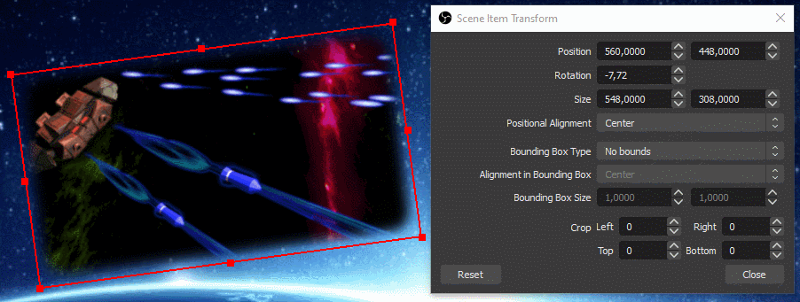

OBS can be extended with Python and Lua scripts. This guide explains the basics to get started and describes how to implement common features.

## Introduction

### Scripting in the OBS ecosystem

Before digging into the details, it is useful to understand the context.

Scripting is a way to add functionality to OBS but it is not the only one, and it is important to know how far it fit the environment before starting to learn a new API and possibly a new language. Namely, here is a non-exhaustive list of methods one could use to develop new functions that interact with OBS:

- [*Plugins*](https://obsproject.com/docs/plugins.html) are typically implemented in C/C++ and compiled into dynamic libraries that are discovered and loaded at run time by OBS. The main advantages of plugins are obviously the performance and the raw access to all functions and libraries of OBS. A significant drawback is the need to setup an OBS compilation environment and to deal with subsequent OBS versions if re-compilation is necessary. In addition, if a wide distribution is envisaged, compilation and installation for different platforms must be considered.
- [*Scripts*](https://obsproject.com/docs/scripting.html) are written in Lua or Python and are interpreted or compiled on-the-fly at run time. Scripts are mostly platform-independent and are usually not affected by slight changes of OBS data structures. They have access to large portions of the OBS C API through bindings. Obvious advantages are the simplified development and maintenance while supporting many features of plugins. The drawback is a lower performance, which is not an issue in most cases.
- [*Browser docks and sources*](https://github.com/obsproject/obs-browser) (for Windows and macOS) can use a small [Javascript API](https://github.com/obsproject/obs-browser#js-bindings) to react to events in OBS and retrieve basic information. They can be hosted on a web-server or locally, and support what Chromium supports (including HTML5, WebGL, etc). They are typically used as sources for overlays reacting to events.
- [*WebSockets*](https://github.com/Palakis/obs-websocket) can be used to remotely control OBS via a [network interface](https://github.com/Palakis/obs-websocket/blob/4.x-current/docs/generated/protocol.md). Different libraries support the protocol for customized applications (C#, Javascript, Python, Java, ..).
- [*Numerous plugins*](https://obsproject.com/forum/list/plugins.35) and [*scripts*](https://obsproject.com/forum/resources/categories/scripts.5) may provide the wished behavior without development. As an example, [StreamFX](https://github.com/Xaymar/obs-StreamFX) supports customized shaders with customizable input parameters for filter, source or transition video effects.

### Comparison of Python and Lua for OBS scripting

Lua is by far less popular and less powerful than Python, but it is simpler on purpose (to reduce the footprint in the embedding executable) and better integrated in OBS (as of v26.1):

| Criteria | [Python](https://www.python.org) | [Lua](https://www.lua.org) |
|-------|--------|-----|
| Ecosystem | Wide usage for everything | Sparse usage as embedded scripting extension (e.g. in [Wireshark](https://gitlab.com/wireshark/wireshark/-/wikis/Lua), [VLC](https://www.videolan.org/developers/vlc/share/lua/README.txt), etc) |
| Standard library | [Full-featured standard library](https://docs.python.org/3.6/library) | [Poor standard library](https://www.lua.org/manual/5.1) (use the OBS API or [FFI](https://luajit.org/ext_ffi.html) to fill the gaps) |
| Additional modules | Supported e.g. with pip | Supported for pure Lua modules, probably possible but complex for modules with binary |
| Interpreter | Not embedded | Fully embedded, based on [LuaJIT](http://luajit.org) |
| New source types | Not supported | [Supported with source_info](https://obsproject.com/docs/scripting.html#script-sources-lua-only) |

### Bindings and data conversion

OBS has a huge API of C functions and data structures. Functions are bound to the scripting environment through _wrapper C functions_ (implementation of the bindings) used for data conversion.

More precisely, when an OBS function is called from a script, the related C wrapper is called to:

- convert the Lua/Python data given as argument into C-compliant data
- call the original wrapped C function
- convert the data returned by the function back to Python/Lua-compliant data

[SWIG](http://www.swig.org) generates automatically such C wrappers for most functions during OBS compilation. For a few functions, the wrappers are written manually (e.g. frontend functions for historical reasons, `source_info` and functions with callback arguments for technical reasons). The names of the functions managed by SWIG are exactly the same as in C, while some differences exist for functions with a manually-written wrapper.

As a side note, even if most functions are usable as intended (especially the ones with manually-written wrappers, i.e. specifically designed for scripting), a few functions with SWIG-written wrappers cannot be used directly for scripting so far, because SWIG cannot interpret properly the data types of arguments or return values given in the C definition. Typically, with values passed by reference or buffers, C pointers are inherently ambiguous.

### Documentation

Scripting-specific API features are described in the [OBS scripting documentation](https://obsproject.com/docs/scripting.html) (notable differences to the C API and most functions with a manually-written wrapper are given there).

The rest of the [API](https://obsproject.com/docs) is documented in the original C flavour, there is no documentation of the functions and data structures as seen from the scripting environment so far, what can be very challenging to determine data type conversions chosen by SWIG!

### Scripts dialog window

Scripts are managed through the _Scripts_ dialog window, displayed via the menu item _Tools > Scripts_:


A list of scripts currently attached to OBS is displayed on the left hand side (here two scripts distributed with OBS). On the right hand side, if any, the description and editable properties of the script are shown. A script can be attached by clicking on :heavy_plus_sign: and selecting the related Python or Lua file, detached with :heavy_minus_sign:. The Refresh button reloads all attached scripts and Defaults resets the values of the editable properties to their default values.

For Python scripts, a decent distribution of Python must be installed by the user, and then the _Python Install Path_ must be selected in the tab _Python Settings_. Please refer to the [OBS scripting documentation](https://obsproject.com/docs/scripting.html) for the supported version of Python (currently only Python 3.6). Depending on the Python installation, locating the installation path can be difficult, e.g. on Windows 10 with Python installed from the Microsoft Store, the installation path is located at `[UserFolder]\AppData\Local\Programs\Python\Python36`.

## Tutorial: source shake script

After this long introduction, let's go into the real stuff. At this stage, depending how you came to this section, it is advisable to take a look at the [OBS scripting documentation](https://obsproject.com/docs/scripting.html) if not already done.

As an educational example, we want to make a script that can "shake a source". In other words, for a given source already present in OBS, we want to continuously rotate it back and forth according to a given frequency and angular amplitude, such that the source jiggles.

### Source setup

Set a source (an image, your webcam, whatever) and give it a name. For this tutorial, let's call the source "Spaceship" such that it is easily identifiable (adapt the name as convenient).

As we will rotate the source, it is better to have it centered. It is not mandatory but the shake effect looks better if the source rotates around its center than around one of its corners.

To do it: select the source, right-click on it, _Transform_ > _Edit transform.._, for _Positional Alignment_ select _Center_, then _Close_ (changing the alignment will change the position of the source):


Please note that the "transform" of a source depends on its actual position in a scene (the same source in another scene would have another transform). Among others, one parameter here is the "Rotation", which will be changed by the script.

### Hello World

Here we go: use a text editor and create a file named `source-shake.py` or `source-shake.lua` (both Python and Lua versions of the code will be given in the next sections). Write only the following line in the file, which works for Python and Lua:

```python
print("Hello World!")
```

Add the file in the _Scripts_ dialog window, open the script log, you should see something like this:


Please note that `print` does the job but is not the best choice for logging, consider using [`blog`](https://obsproject.com/docs/reference-libobs-util-base.html?highlight=blog#c.blog) instead.

If this works, you can remove the Hello World line in your file.

### Script description

As a next step, create the function called `script_description` (no arguments) that returns a character string with the description. The script window will look like:


Please note that the description string follows the general Qt format, meaning that a [subset of HTML](https://doc.qt.io/qt-5/richtext-html-subset.html) can be used for formatting. A self-contained [Data URI](https://en.wikipedia.org/wiki/Data_URI_scheme) of a PNG or BMP file can be used as well to show a picture in the description.


### Effect



