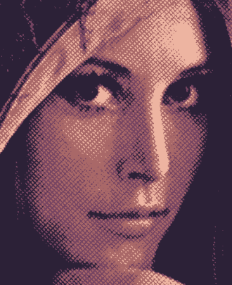
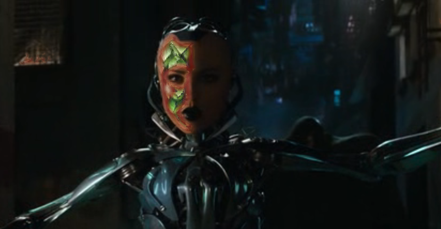
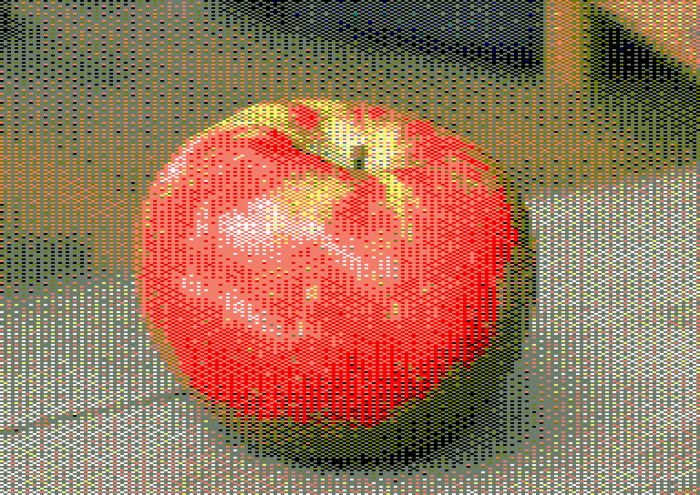

# Additions to OBS the Open Broadcaster Software

[OBS](https://obsproject.com/) is a popular piece of software used to stream live on [Twitch](https://www.twitch.tv) or other channels. It is extensible through [plugins](https://obsproject.com/forum/list/obs-studio-plugins.35/) to add video effects or data connections. OBS is [well-documented](https://obsproject.com/docs/index.html) and available for Windows, macOS and Linux.

At its kernel, for maximal performance, OBS is largely based on GPU-based video processing in the form of [DirectX / OpenGL shaders](https://obsproject.com/docs/graphics.html) (encapsulated in DirectX-like `.effect` files).

Various stuff running under OBS can be found in this repository.

## OBS Wiki Pages

Some OBS Wiki pages were prepared on this repository before going to the official OBS repository:

- The main [Getting started with OBS scripting](wiki/Getting-Started-with-OBS-Scripting.md) ([OBS Wiki page](https://github.com/obsproject/obs-studio/wiki/Getting-Started-With-OBS-Scripting)) page is a general description of the capabilities of scripting, some alternatives and hints for troubleshooting.

- The [Source Shake tutorial](wiki/Scripting-Tutorial-Source-Shake.md) ([OBS Wiki page](https://github.com/obsproject/obs-studio/wiki/Scripting-Tutorial-Source-Shake)) shows how to build a simple script that animates a source. The [script is available here in Lua](wiki/source-shake.lua) and [in Python](wiki/source-shake.py).

- The [Halftone Filter tutorial](wiki/Scripting-Tutorial-Halftone-Filter.md) ([OBS Wiki page](https://github.com/obsproject/obs-studio/wiki/Scripting-Tutorial-Halftone-Filter)) shows how to build a video filter in Lua with a halftone effect. The source files are available here, for the first part the [Lua script](wiki/filter-halftone.lua) and related [effect file](wiki/filter-halftone.effect.hlsl) and for the second part the [final script embedding the effect code in Lua](wiki/filter-halftone-final.lua). There is as well a [development version](wiki/filter-halftone-dithering.lua) of the script.

## BFX Texture Skin Filter

This ["skin" OBS filter](filter-bfx-texture-skin/README.md) can be used to replace certain areas of a particular color in the source with a texture. It is a quick-and-dirty, very basic attempt to produce a skin replacement effect.

## Effects for StreamFX

Some early effects were [developed for StreamFX](streamfx/README.md), e.g. the first attempt to reproduce Amstrad CPC pictures.

