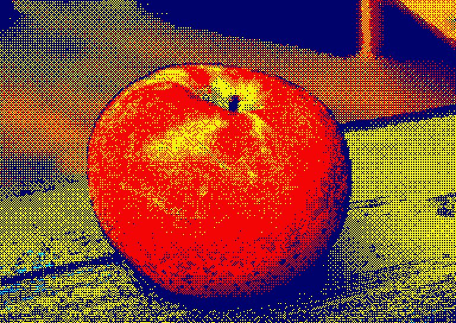

# Additions to OBS the Open Broadcaster Software

[OBS](https://obsproject.com/) is a popular piece of software used to stream live on [Twitch](https://www.twitch.tv) or other channels. It is extensible through [plugins](https://obsproject.com/forum/list/obs-studio-plugins.35/) to add video effects or data connections. OBS is [well-documented](https://obsproject.com/docs/index.html) and available for Windows, macOS and Linux.

At its kernel, for maximal performance, OBS is largely based on GPU-based video processing in the form of [DirectX / OpenGL shaders](https://obsproject.com/docs/graphics.html) (encapsulated in DirectX-like `.effect` files).

Various stuff running under OBS with the [StreamFX](https://obsproject.com/forum/resources/streamfx-for-obs-studio.578/) plugin can be found in this repository.

## Amstrad CPC display filter for StreamFX

The purpose of this effect file is to display a source video as an [Amstrad CPC](https://en.wikipedia.org/wiki/Amstrad_CPC) would display it. To use it, install StreamFX in OBS, then add a "Shader" filter to the source and load the [cpc.effect](cpc.effect) file.

### Resolution and supported modes

The 3 standard *CPC video modes* are supported, plus one fictive mode used for debug:
- Mode 0: 160x200 in 16 colors out of 27
- Mode 1: 320x200 in 4 colors out of 27
- Mode 2: 640x200 in 2 colors out of 27
- "Mode 3": non-standard resolution and all 27 colors

It is recommended to **set the shader resolution to 768x544**, which corresponds to a PAL resolution (768x576) cropped to the visible area of the CPC monitor (272 lines interlaced).

The display area of the CPC is surrounded by a border with a solid color. The width of the border is configurable to mimic the so-called *overscan*. The default setting of the *overscan level* is such that the classical CPC border as in BASIC is displayed. Set it to 1.0 to let the border disappear completely. The borders crops the image, there is no re-scale performed by adapting the overscan level.

 On a 768x544 picture, with the *default settings* i.e. Mode 1, no outline, no overscan, dithering 50% with Bayer8x8 matrix, standard colors as in BASIC, the output should look like this (source [apple picture from Wikimedia](https://commons.wikimedia.org/wiki/File:The_SugarBee_Apple_now_grown_in_Washington_State.jpg)):

With overscan set to 1.0 in Mode 0:

With overscan in the *non-existing Mode 3*:

With overscan in Mode 2 (it is likely that you see aliasing effects depending on the resolution of your monitor and size of browser window):

It is possible to convert the source picture to a *gray scale* (based on classical luminance). This improves the rendering in Mode 2:

The parameter *pixel size* can be used to re-fine the resolution:
- 0: Exact scaled resolution of the CPC. ATTENTION: even if this pixel size mimics perfectly the CPC resolution, it leads to aliasing effects if the resolution of the source is to low. For better results it is recommended to increase the filter resolution to e.g. 500% or force it to 768x544.
- 1: Uses the resolution of the source (if the filter resolution is set to 100%), or the resolution of the filter
- 2 - 8: Same as 1 but uses blocks of 2x2 pixels if set to 2, 3x3 if set to 3, etc

In Mode 1 with pixel size 4:

### Colors, palette and inks

In Modes 0/1/2, the shader lets the user choose the "inks", i.e. the 2, 4 or 16 colors out of 27, plus the border color. Of course, selecting correct colors can improve the rendering but it remains quite difficult to find the correct set.

Using false colors which are more or less similar to the original colors can give good results as well. As an example, in Mode 1 with gray scale and 4 colors in a shade of blue:

The complete palette of the Amstrad CPC contains 27 colors. Three slightly different variants of the palette are available to reproduce the electrical signal levels transmitted to the CRT (see [the grimware page](https://www.grimware.org/doku.php/documentations/devices/gatearray)):
- Original Gate Array
- ASIC embedding the Gate Array (last CPC generation)
- Theoretically perfect signals

### Dithering

The common "ordered" [dithering algorithm](https://en.wikipedia.org/wiki/Dither) is used. The processing on each pixel can be described as:
- Adds a small value to each RGB component, value which is extracted from the *dithering matrix* wrapped using a modulo on the position of the pixel
- Finds the closest color, from the selected inks, to this color with error

In average, the mix of the determined color approaches the original color.

A parameter *dithering spread* can be used to adjust the magnitude of the added error, and hence control how far pixels appear on the pictures. A lower spread value leads to separated layers with pixels of the same color:

On the contrary, a high spread value mixes the pixels of all colors, reducing the readability of the picture:

Several matrices are available, either based on a Bayer matrix or on a spiral-dot pattern:
- 1: 2x2 Bayer
- 2: 4x4 Bayer
- 3: 8x8 Bayer
- 4: 3x3 Dot
- 5: 3x3 Dot with RGB offsets
- 6: 5x5 Dot
- 7: 5x5 Dot with RGB offsets
- 8: 6x6 Dot
- 9: 6x6 Dot with RGB offsets

The dot patterns give a printed newspaper effect:

Finally, to fine-tune the dithering, a *gamma correction* can be used.

### Transparency

The transparency level of each ink can be set:

### Outline

An outline based on edge detection on luminance can be added to increase the pixel-art look:

## Large message scroll with Amstrad CPC font for StreamFX

The purpose here is to display a text with a raster-like effect using the Amstrad CPC common character font:

With the current setting the messages scrolls horizontally. Few input parameters are available. Modify the shader directly to fullfil your needs.

