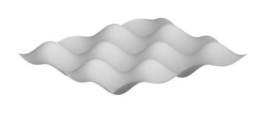
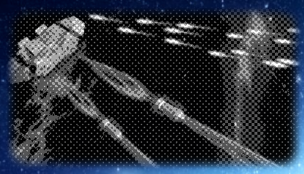
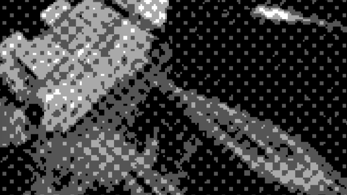
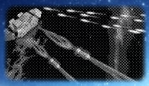
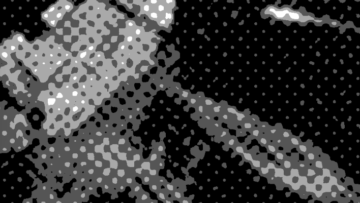

# Scripting Tutorial Halftone Filter

This tutorial describes the implementation of a "halftone" filter as a Lua script for OBS. Such a filter appears in the list of filters and can be added as part of a filter chain to any video source. As effect, the filter mimics the [halftone technique](https://en.wikipedia.org/wiki/Halftone), used for printing with a reduced set of ink colors arranged in patterns. It is based on [dithering](https://en.wikipedia.org/wiki/Dither) with a carefully designed texture.

## First part - 4 Shades of Grey

The tutorial is divided into two parts. In this first part, we create a minimal script that implements a simple rendering effect. Such a script with its effect file can be easily re-used as starting point for new projects.

### Script creation

Similarly to the [Source Shake tutorial](https://github.com/obsproject/obs-studio/wiki/Scripting-Tutorial-Source-Shake), create a script file named `filter-halftone.lua` with this content:

``` Lua
obs = obslua

-- Returns the description displayed in the Scripts window
function script_description()
  return [[<center><h2>Halftone Filter</h2></center>
  <p>This Lua script adds a video filter named <it>Halftone</it>. The filter can be added
  to a video source to reduce the number of colors of the input picture. It reproduces
  the style of a magnified printed picture.</p>]]
end
```

Add the new script in the _Scripts_ window, the description should appear (with no properties).

### Registering a first source info structure

Sources are supported in Lua through the [`source_info` structure](https://obsproject.com/docs/scripting.html#script-sources-lua-only). It is defined as a usual Lua table containing a set of mandatory keys referencing values and functions that mimic a subset of the [C `obs_source_info` structure](https://obsproject.com/docs/reference-sources.html?highlight=source_info#c.obs_source_info).

The `source_info` structure is registered using [`obs_register_source`](https://obsproject.com/docs/reference-sources.html#c.obs_register_source). OBS will use the structure to create the internal data and settings when the filter is added to an existing video source. A filter has its own independent set of properties and data settings, i.e. an instance of such settings exists for each filter instance. OBS manages the filter creation, destruction and the persistent storage of its settings.

Let's create the source info structure for a video filter with a minimal set of values and functions. It is typically registered in `script_load`:

``` Lua
-- Called on script startup
function script_load(settings)
  obs.obs_register_source(source_info)
end

-- Definition of the global variable containing the source_info structure
source_info = {}
source_info.id = 'filter-halftone'              -- Unique string identifier of the source type
source_info.type = obs.OBS_SOURCE_TYPE_FILTER   -- INPUT or FILTER or TRANSITION
source_info.output_flags = obs.OBS_SOURCE_VIDEO -- Combination of VIDEO/AUDIO/ASYNC/etc

-- Returns the name displayed in the list of filters
source_info.get_name = function()
  return "Halftone"
end
```

Add the code, refresh the script, then choose a source (here a colorful picture of the VR game Anceder) and display the _Filter_ dialog window for the source (e.g. _Filters_ in the context menu of the source). Click on <kbd>+</kbd> and the name _Halftone_ should appear in the list of filters:


Add the new _Halftone_ filter. For now the filter has no effect because the `source_info.create` function is not defined.

### Effect compilation and rendering

Lua would not be fast enough for video processing so the filter is based on GPU computation. A GPU can be programmed through "shaders" compiled by the graphics device driver from [GLSL](https://en.wikipedia.org/wiki/OpenGL_Shading_Language) for OpenGL or [HLSL](https://en.wikipedia.org/wiki/High-Level_Shading_Language) in the MS Windows world. OBS relies on HLSL and expects shader code in the so-called [effect files](https://obsproject.com/docs/graphics.html).

An effect can be compiled from a file with [`gs_effect_create_from_file`](https://obsproject.com/docs/reference-libobs-graphics-effects.html#c.gs_effect_create_from_file) or from a string with [`gs_effect_create`](https://obsproject.com/docs/reference-libobs-graphics-effects.html#c.gs_effect_create), and is destroyed with [`gs_effect_destroy)`](https://obsproject.com/docs/reference-libobs-graphics-effects.html#c.gs_effect_destroy). Like other graphic functions in OBS, manipulating effects needs to occur in the [graphics context](https://obsproject.com/docs/graphics.html#the-graphics-context). This is ensured by calling [`obs_enter_graphics`](https://obsproject.com/docs/reference-core.html#c.obs_enter_graphics) and then [`obs_leave_graphics`](https://obsproject.com/docs/reference-core.html#c.obs_leave_graphics) when everything is done.

The compilation is typically implemented in the [`source_info.create`](https://obsproject.com/docs/reference-sources.html#c.obs_source_info.create) function and resources are released in the [`source_info.destroy`](https://obsproject.com/docs/reference-sources.html#c.obs_source_info.destroy) function. `source_info.create` returns a Lua table containing custom data used for the filter instance. Most functions of the `source_info` structure will provide this Lua table passed as an argument, so this is where you want to store any custom data needed by the filter. Please note that if `source_info.create` returns `nil`, then the filter initialization is considered failed (and logged accordingly).

Add this code to the Lua script:

``` Lua
-- Creates the implementation data for the source
source_info.create = function(settings, source)

  -- Initializes the custom data table
  local data = {}
  data.source = source -- Keeps a reference to this filter as a source object
  data.width = 1       -- Dummy value during initialization phase
  data.height = 1      -- Dummy value during initialization phase

  -- Compiles the effect
  obs.obs_enter_graphics()
  local effect_file_path = script_path() .. 'filter-halftone.effect.hlsl'
  data.effect = obs.gs_effect_create_from_file(effect_file_path, nil)
  obs.obs_leave_graphics()

  -- Calls the destroy function if the effect was not compiled properly
  if data.effect == nil then
    obs.blog(obs.LOG_ERROR, "Effect compilation failed for " .. effect_file_path)
    source_info.destroy(data)
    return nil
  end

  return data
end

-- Destroys and release resources linked to the custom data
source_info.destroy = function(data)
  if data.effect ~= nil then
    obs.obs_enter_graphics()
    obs.gs_effect_destroy(data.effect)
    data.effect = nil
    obs.obs_leave_graphics()
  end
end
```

The effect file `filter-halftone.effect.hlsl` is mentioned in the code, it will defined in the next section. Please note that the `source` argument of the function `source_info.create` is a reference to the current instance of the filter as a source object (almost everything is a source in OBS). This reference, as well as the variables `width` and `height`, initialized with dummy values, are used in the rendering function.

Namely, the function [`source_info.video_render`](https://obsproject.com/docs/reference-sources.html#c.obs_source_info.video_render) is called each frame to render the output of the filter in the graphics context (no need to call `obs_enter_graphics`). To render an effect, first [`obs_source_process_filter_begin`](https://obsproject.com/docs/reference-sources.html#c.obs_source_process_filter_begin) is called, then the effect parameters can be set, and then [`obs_source_process_filter_end`](https://obsproject.com/docs/reference-sources.html#c.obs_source_process_filter_end) is called to draw.

Determining the width and height to pass to `obs_source_process_filter_end` is somehow tricky in OBS, because the filter is itself in a chain of filters, where the resolution could theoretically change at any stage. The usual method is to retrieve the "parent source" of the filter with [`obs_filter_get_parent`](https://obsproject.com/docs/reference-sources.html#c.obs_filter_get_parent), i.e. "the source being filtered", and then to use the so far undocumented functions `obs_source_get_base_width` and `obs_source_get_base_height`. Note that some filters reference the next source in the chain using `obs_filter_get_target`, not the source being filtered (it may make a difference depending on the use case).

In addition, two additional functions `source_info.get_width` and `source_info.get_height` must be defined to provide the values to OBS whenever necessary. The functions will re-use the values determined in `source_info.video_render`.

The effect rendering code looks like:

``` Lua
-- Returns the width of the source
source_info.get_width = function(data)
  return data.width
end

-- Returns the height of the source
source_info.get_height = function(data)
  return data.height
end

-- Called when rendering the source with the graphics subsystem
source_info.video_render = function(data)
  local parent = obs.obs_filter_get_parent(data.source)
  data.width = obs.obs_source_get_base_width(parent)
  data.height = obs.obs_source_get_base_height(parent)

  obs.obs_source_process_filter_begin(data.source, obs.GS_RGBA, obs.OBS_NO_DIRECT_RENDERING)

  -- Effect parameters initialization goes here

  obs.obs_source_process_filter_end(data.source, data.effect, data.width, data.height)
end
```

Add the code blocks to the Lua script, but no need to reload for now, the effect file is still missing.

### Simple HLSL luminance effect file

The Lua code is in place, now create a new file called `filter-halftone.effect.hlsl` in the same directory as the Lua script.

:warning: The extension `.hlsl` is chosen such that a code editor or an IDE recognizes directly that it is HLSL code. As the parser of OBS may miss unbalanced brackets or parenthesis (and say nothing about it in the logs), it is very important to have syntax checking in the editor.

An [effect file](https://docs.microsoft.com/en-us/windows/win32/direct3d11/d3d11-effect-format) follows a strict syntax and structure. It is a mix of static data definitions and code. These constraints are necessary to allow the compilation for the GPU and the massively parallel execution. The various parts are described below.

Our effect file starts with macro definitions that will allow writing HLSL-compliant code instead of the effect dialect understood by OBS, in order to support a full syntax check in the IDE. Indeed, the keywords `sampler_state` and `texture2d` are specific to effects in OBS. Using such macros is of course not mandatory (and not so common looking at other OBS effect files):

``` HLSL
// OBS-specific syntax adaptation to HLSL standard to avoid errors reported by the code editor
#define SamplerState sampler_state
#define Texture2D texture2d
```

Then the two mandatory `uniform` parameters required by OBS are defined. The values of these parameters will be set transparently by OBS according to the input picture of the source being filtered set in `image`, and the "View-Projection Matrix" `ViewProj` used to compute the screen coordinates where the filtered picture will be drawn:

``` HLSL
// Uniform variables set by OBS (required)
uniform float4x4 ViewProj; // View-projection matrix used in the vertex shader
uniform Texture2D image;   // Texture containing the source picture
```

The next definition is a "[sampler state](https://docs.microsoft.com/en-us/windows/win32/api/d3d11/ns-d3d11-d3d11_sampler_desc)". It defines how to sample colors from pixels in a texture, i.e. how to interpolate colors between two pixels (Linear) or just to take the next neighbor (Point), and how to behave in the the pixel coordinates are outside of the texture, i.e. take the pixels from the nearest edge (Clamp), wrap around (Wrap) or mirror the texture over the edges (Mirror). The [supported values for sampler states](https://obsproject.com/docs/graphics.html#effect-sampler-states) are documented in the OBS API reference.

We define a simple linear clamp sampler state that will be used in the pixel shader:

``` HLSL
// Interpolation method and wrap mode for sampling a texture
SamplerState linear_clamp
{
    Filter    = Linear;     // Anisotropy / Point / Linear
    AddressU  = Clamp;      // Wrap / Clamp / Mirror / Border / MirrorOnce
    AddressV  = Clamp;      // Wrap / Clamp / Mirror / Border / MirrorOnce
    BorderColor = 00000000; // Used only with Border edges (optional)
};
```

After that, two very specific data structures are defined to specify which parameters are given to the vertex shader, and passed from the vertex shader to the pixel shader. In this tutorial these structures are artificially separated for better understanding and more generality. In most effects, both structures are defined in only one structure.

The structures require for each parameter a [semantics](https://docs.microsoft.com/en-us/windows/win32/direct3dhlsl/dx-graphics-hlsl-semantics) identifier giving the intended use of the parameter. [Supported semantics](https://obsproject.com/docs/graphics.html#effect-vertex-pixel-semantics) are documented in the OBS API reference. Semantics are necessary for the graphics pipeline of the GPU:

``` HLSL
// Data type of the input of the vertex shader
struct vertex_data
{
    float4 pos : POSITION;  // Homogeneous space coordinates XYZW
    float2 uv  : TEXCOORD0; // UV coordinates in the source picture
};

// Data type of the output returned by the vertex shader, and used as input 
// for the pixel shader after interpolation for each pixel
struct pixel_data
{
    float4 pos : POSITION;  // Homogeneous screen coordinates XYZW
    float2 uv  : TEXCOORD0; // UV coordinates in the source picture
};
```

Before going further, some words about the classical 3D rendering pipeline. Roughly speaking, it comprises these main steps:

- The application, here OBS, set-ups all data structures (textures, data parameters, arrays, etc) necessary for the computation and then feeds the 3D coordinates of triangles into the vertex shader together with various vertex attributes such as UV coordinate of the vertex mapped to a texture or a color assigned to this vertex, all part of the `vertex_data` structure.
- Each time a `vertex_data` structure is available in the GPU, the _vertex shader_ is called and returns a `pixel_data` structure corresponding to the pixel under the vertex as seen on the screen. During this call, the vertex shader transforms the 3D world coordinates of the vertex into screen coordinates, and transforms the other vertex attributes if necessary.
- Then many complex steps are performed by the GPU to determine how far the surface of each triangle is visible on the screen, up to each visible pixel.
- Each time the GPU determines that a pixel of a triangle is visible, it calls the _pixel shader_ with a `pixel_data` structure as argument that corresponds to the position of the pixel. In order to provide position-specific values for each pixel of the triangle, the GPU interpolates values from the values of the 3 structures returned for the 3 vertices of the triangle by the vertex shader.

To render sources, OBS follows the same model and renders simply quads (2 triangles) on the screen, where each vertex has the UV mapping of the source picture as attribute. The vertex shader is only used to compute the screen coordinates of the 4 vertices of the quad, according to the transform of the source, and to pass the UV coordinates to the pixel shader. The classical method for the transformation of world coordinates into screen coordinates is a [multiplication through the "View-Projection" 4x4 matrix in homogeneous coordinates](http://www.it.hiof.no/~borres/j3d/math/threed/p-threed.html) (don't be afraid, it is not necessary to understand homogeneous coordinates for the tutorial):

``` HLSL
// Vertex shader used to compute position of rendered pixels and pass UV
pixel_data vertex_shader_halftone(vertex_data vertex)
{
    pixel_data pixel;
    pixel.pos = mul(float4(vertex.pos.xyz, 1.0), ViewProj);
    pixel.uv  = vertex.uv;
    return pixel;
}
```

The vertex shader will remain like this in most cases with OBS. Altering the 3D transformation would change the proper location of displayed sources on the screen. Note that interesting results could be achieved, e.g. actually the Source Shake animation could be certainly implemented as a smart modification of the View-Projection matrix.

Please note the well-adapted HLSL syntax `vertex.pos.xyz` here. `pos` is a `vertex` member with vector type `float4`. Adding the suffix `.xyz` is sufficient to convert it to a temporary `float3` vector with the values of the components `x`, `y` and `z` of `pos`. Then `float4(vertex.pos.xyz, 1.0)` is again a `float4` vector with the 3 first components of `vertex.pos.xyz` and `1.0` as fourth component. The HLSL syntax, which is by the way very similar to GLSL used in OpenGL, has this special feature that makes it very compact for matrix and vector operations.

Now the real heart of the video filter effect is in the Pixel Shader. The main principle of a pixel shader is very simple: this is a function that computes a color at a given pixel position. The pixel shader function is called for every single pixel within the draw area.

As a simple gray shading effect, we want to compute the "luminance" of the source pixel (i.e. its brightness or luminous intensity), and use it for each RGB component of the output color:

``` HLSL
// Pixel shader used to compute an RGBA color at a given pixel position
float4 pixel_shader_halftone(pixel_data pixel) : TARGET
{
    float4 source_sample = image.Sample(linear_clamp, pixel.uv);
    float luminance = dot(source_sample.rgb, float3(0.299, 0.587, 0.114));
    return float4(luminance.xxx, source_sample.a);
}
```

Please again admire the incredibly compact syntax:

- On the first line, the `source_sample` variable receives the RGBA color of the pixel at `pixel.uv` in the source picture in UV coordinates, following a sampling method given by `linear_clamp`. Attention: here `.uv` is just a `float2` member of the structure `pixel`, not a suffix to access particular vector components.
- On the second line, the [relative luminance](https://en.wikipedia.org/wiki/Relative_luminance) is computed as a [dot product](https://en.wikipedia.org/wiki/Dot_product) of the `float3` vector of the RGB components of `sample_color` and the constant `float3` vector _(0.299, 0.587, 0.114)_. The expression is equivalent to `source_sample.r*0.299 + source_sample.g*0.587 + source_sample.b*0.114`. Suffices `r`, `g`, `b`, `a` can be used like `x`, `y`, `z`, `w` to access particular vector components. It is necessary to write `source_sample.rgb` here because it is a `float4` vector and we want to exclude the `a` component from the dot product.
- On the third line, a `float4` vector is built with three time the `luminance` value and then the original alpha value of the source color as fourth component. The color is returned as a `float4` containing the values of the RGBA components between 0.0 and 1.0.

The position of the pixel is provided through the `pixel_data` structure:

- `pixel.pos` is a `float4` vector resulting from the computation in the vertex shader and further interpolation. In the pixel shader `pixel.pos.xy` may contain the absolute position on screen of the pixel being rendered (i.e. values change if the user moves the source with the mouse). Now if the source is itself scaled with a setting of _Scale filtering_ different than _Disable_, or if some other filter needs to render in a texture as an intermediate step, then `pixel.pos.xy` may contain some other pixel coordinates corresponding to the internal texture used to render the output of our filter before further processing. In addition, as `pixel.pos` is in homogeneous coordinates, normally it is necessary to divide `x` and `y` by the `w` components (which should be always equal to 1 here as there is no 3D). Long story short, it is not recommended to use `pixel.pos` directly.
- `pixel.uv` gives the interpolated UV coordinates of the pixel in the source picture as a `float2` vector, i.e. it does not depend on the position or scaling of the source. As UV coordinates, `pixel.uv.x` and `pixel.uv.y` have values in range 0.0 to 1.0, with the upper left corner of the source picture is at position (0.0,0.0) and the bottom right corner at (1.0,1.0). This is what we want to use to reference the source pixels. In addition, the UV coordinates can be used directly to retrieve the pixel color from the `image` texture.

The final part of the effect file is the definition of the "techniques". Here again the structure will be similar in most effects, typically with one pass and one technique:

``` HLSL
technique Draw
{
    pass
    {
        vertex_shader = vertex_shader_halftone(vertex);
        pixel_shader  = pixel_shader_halftone(pixel);
    }
}
```

Add all the code blocks in the HLSL file, then restart OBS, normally the source should be displayed in black and white:


Well, this is not really a halftone picture here, but it clearly shows the expected shades of gray according to the luminance. The example picture is very dark and needs some luminosity correction.

### Gamma correction

Colors are typically encoded with 8 bits for each RGB component, i.e. in range 0 to 255, corresponding to the range 0.0 to 1.0 in HLSL. But because the human eye has a [non-linear perception of the light intensity](http://blog.johnnovak.net/2016/09/21/what-every-coder-should-know-about-gamma/) emitted by the monitor, usually the values encoded in RGB components do not grow linearly with the intensity, they follow a power law with an exponent called "gamma". This non-linearity of the RGB components can be a problem in a video filter if some computation is performed assuming components are encoded in a linear way.

Actually, in the frame of an OBS filter, this is not always an issue. Some sources will provide linearized pixel data to the shaders, some others will provide gama-encoded data. As of version 26.1, several attempts were made to have consistently linearized colors available in shaders. As long as it is not fully implemented, to give the maximum flexibility, we will to let the user select if the source is gamma-encoded or not. As the filter of this tutorial is more artistic than exact, a user would just try different settings to get the best result.

The power law for encoding and decoding uses typically an exponent _2.2_ or _1/2.2_. The two operations of [gamma correction](https://en.wikipedia.org/wiki/gamma_correction) are called first _gamma compression_, i.e. encoding of an RGB component proportional to the light intensity into a value to be displayed to a human eye, with an exponent lower than 1, and _gamma expansion_ with an exponent greater than 1.

Let's call _gamma_ the exponent used for color decoding (greater than 1) with a value of _2.2_. We can use simplified formulas for gamma encoding:

_encoded_value = linear_value <sup>1/gamma</sup>_

And for gamma decoding:

_linear_value = encoded_value <sup>gamma</sup>_

Please note that such formulas keep values nicely between 0.0 and 1.0.

Now to come back to the halftone filter, we noted that the example picture is a bit too dark, and we know that changing the "gamma" of a picture change its overall luminosity. So we can introduce a gamma computation for 2 purposes: use of linear values for more exact calculations and a "gamma shift" of the source picture (not called "gamma correction" to avoid misunderstandings).

Namely, a gamma decoding including a subtractive shift would look like this, performed _before_ any computation on the RGB color components (with a minus such that positive values increase the luminosity):

_linear_value = encoded_value <sup>gamma-shift</sup>_

Let's do it in the code, starting with the definition of the `gamma` and `gamma_shift` uniform variables and default values with other uniform variables at the top of the HLSL effect file:

``` HLSL
// General properties
uniform float gamma = 1.0;
uniform float gamma_shift = 0.6;
```

Experiment and adapt the default values of `gamma` and `gamma_shift` to your source. They will be defined through OBS properties later on.

We introduce the gamma encoding and decoding functions, and re-write the pixel shader to use it. We use an additional `clamp` function to be sure to keep values between 0.0 and 1.0 before the exponentiation. In fact this may not be necessary but it avoids a warning that may be produced by the compiler. Add the code below the vertex shader:

``` HLSL
float3 decode_gamma(float3 color, float exponent, float shift)
{
    return pow(clamp(color, 0.0, 1.0), exponent - shift);
}

float3 encode_gamma(float3 color, float exponent)
{
    return pow(clamp(color, 0.0, 1.0), 1.0/exponent);
}

// Pixel shader used to compute an RGBA color at a given pixel position
float4 pixel_shader_halftone(pixel_data pixel) : TARGET
{
    float4 source_sample = image.Sample(linear_clamp, pixel.uv);
    float3 linear_color = decode_gamma(source_sample.rgb, gamma, gamma_shift);

    float luminance = dot(linear_color, float3(0.299, 0.587, 0.114));
    float3 result = luminance.xxx;

    return float4(encode_gamma(result, gamma), source_sample.a);
}
```

Add all the code blocks in the HLSL file, then _restart OBS_ (only reloading the script would not help, because the effect remains cached and would not be re-compiled). Depending on the values you select for `gamma` and `gamma_shift`, the filtered picture should have a different overall luminosity:


The picture is a bit better now.

### Width and height from Lua to the shader

Whatever the final form, the halftone effect is based on a pattern applied pixel-by-pixel to the source picture. While it is easy to transform the color of a single pixel, if the position of the pixel is necessary to recognize in which part of a pattern the pixel is located, then the UV coordinates alone are not sufficient in the general case, it is necessary to know the size of the source picture. More about the calculations in the next section.

In this section we will first see how to make the values of `width` and `height` available in the shader from the Lua code. Strangely, OBS does not foresee these parameters in effect files by default. We define the `uniform` variables with other uniform variables at the top of the HLSL effect file:

``` HLSL
// Size of the source picture
uniform int width;
uniform int height;
```

Only uniform variables can be changed from the Lua code. Once an effect is compiled, the function [`gs_effect_get_param_by_name`](https://obsproject.com/docs/reference-libobs-graphics-effects.html#c.gs_effect_get_param_by_name) provides the necessary `gs_eparam` structure where the value can be set.

The effect parameters can be retrieved at the end of the `source_info.create` in the Lua file (above `return data`):

``` Lua
  -- Retrieves the shader uniform variables
  data.params = {}
  data.params.width = obs.gs_effect_get_param_by_name(data.effect, "width")
  data.params.height = obs.gs_effect_get_param_by_name(data.effect, "height")
```

Finally the values are set with [`gs_effect_set_int`](https://obsproject.com/docs/reference-libobs-graphics-effects.html#c.gs_effect_set_int) between `obs_source_process_filter_begin` and `obs_source_process_filter_end` in in `source_info.video_render`:

``` Lua
  -- Effect parameters initialization goes here
  obs.gs_effect_set_int(data.params.width, data.width)
  obs.gs_effect_set_int(data.params.height, data.height)
```

Add the code, restart OBS, for now no difference is expected, the interesting things start in the next section.

### Luminance perturbation

Now that the size of the picture is available, we can start to use pixel coordinates for formulas. Namely, we want to add a little perturbation on the computed luminance according to the formula _cos(x)*cos(y)_. The form of this classic formula looks like:



The formula will be such that:

- It adds to the luminance a small negative or positive value with a given amplitude
- The scale of the form can be changed, with a scale of 1.0 corresponding to a 8 pixels long oscillation

If we name the parameters of the formula simply _scale_ and _amplitude_, assuming _x_ and _y_ are in pixels, the angle for the oscillations on _x_ is given by _2\*&pi;\*x/scale/8_ (the bigger the _scale_, the longer the oscillations). The cosine function returns values between -1.0 and 1.0, so the _amplitude_ can be just multiplied to the product of cosine.

The final parameterized formula will be (with simplification):

_perturbation = amplitude\*cos(&pi;\*x/scale/4)\*cos(&pi;\*y/scale/4)_

For the coordinates _x_ and _y_ in pixels, as we have the _width_ and _height_ plus the UV coordinates, the formula are simply _x = U * width_ and _y = V * height_ if we call the UV coordinates _U_ and _V_ here. In the code, we will use a more compact form with a component-by-component multiplication of `pixel.uv` with `float2(width,height)`.

Re-write the center part of the pixel shader (between the decoding and encoding lines) in the HLSL effect file:

``` HLSL
    float luminance = dot(linear_color, float3(0.299, 0.587, 0.114));
    float2 position = pixel.uv * float2(width, height);
    float perturbation = amplitude * cos(PI*position.x/scale/4.0) * cos(PI*position.y/scale/4.0);
    float3 result = (luminance + perturbation).xxx;
```

At the top of the file, do not forget to define a new constant for `PI` and the new uniform variables `scale` and `amplitude` with default values:

``` HLSL
// Constants
#define PI 3.141592653589793238

// General properties
uniform float amplitude = 0.2;
uniform float scale = 1.0;
```

Add the code, restart OBS, now the effect should look like this:


It slowly starts to look like a halftone.

### Reducing the number of colors

Until now we use a continuous luminance. The next step is to mimic a reduced number of inks on a printed paper.

For a given value of luminance from 0.0 to 1.0, we can multiply the value by a constant factor and then round the product to obtain a certain number of integer values. For example, with a factor of 3, we obtain the values 0, 1, 2 and 3. The we re-divide by 3 to obtain 4 luminance values with values 0.0, 0.33, 0.66 and 1.0. It can be generalized to _n_ colors by multiplying/dividing by _n-1_.

The computation is really simple to implement. We start by adding a global uniform number of color levels with other uniform variables at the top of the HLSL effect file:

``` HLSL
uniform int number_of_color_levels = 4.0;
```

And we add a single line in the pixel shader, just before the gamma encoding:

``` HLSL
    result = round((number_of_color_levels-1)*result)/(number_of_color_levels-1);
```

Add the code, restart OBS, now the effect should look like this:



Here we are! It is nice to see what a simple cosine-based perturbation plus rounding can do. The active part of the effect is just a couple of lines long.

And now it is also very interesting to check how the effect behaves with different kinds of scale filtering (context menu of the source in OBS, then _Scale Filtering_).

First example, the scale filtering _Point_ does not perform any interpolation after zoom and shows square-formed pixels:



Typically, as we use a periodic pattern in the effect, "aliasing" artifacts may appear if we reduce the size of the picture:


With a scale filtering set to _Bicubic_, the interpolation after scaling shows anti-aliasing:


With reduced size, the aliasing is not completely gone but at least reduced:



Now a very interesting effect appears when the scale filtering is set to _Disable_ on a strongly zoomed picture (attention it may not work if other filters are in the chain of the source). The pixel shader renders directly to the screen (the output is not rendered into an intermediate texture for later scaling), so it is called for every single pixel in the screen space, at a sub-pixel level for the source picture. As we use continuous mathematical functions, and sample the source picture using a `Linear` interpolation with `linear_clamp`,  the curves drawn by the pixel shader hide completely the pixel grid of the source picture. It looks like a vector drawing:



With reduced size it still behaves well:


The cosine-based halftone effect is completely implemented now. It has many parameters set with default values but the user cannot set these parameters so far.

### Adding properties

The effect is already satisfactory, we now want to improve the user experience by creating properties for the uniform variables that we already have in the effect file:`gamma`,  `gamma_shift`, `amplitude`, `scale` and `number_of_color_levels`.

By convention, we will name all instances of the variables or properties with the sames names as in the effect file, i.e. for the effect parameters, the data settings and the variables of the `data` structure.

Similarly to what is described in the Source Shake tutorial, we first have to define default values in [`source_info.get_defaults`](https://obsproject.com/docs/reference-sources.html#c.obs_source_info.get_defaults). Default values are chosen such that applying them to a new source would give a reasonable result:

``` Lua
-- Sets the default settings for this source
source_info.get_defaults = function(settings)
  obs.obs_data_set_default_double(settings, "gamma", 1.0)
  obs.obs_data_set_default_double(settings, "gamma_shift", 0.0)
  obs.obs_data_set_default_double(settings, "scale", 1.0)
  obs.obs_data_set_default_double(settings, "amplitude", 0.2)
  obs.obs_data_set_default_int(settings, "number_of_color_levels", 4)
end
```

Then we define the properties as sliders in [`source_info.get_properties`](https://obsproject.com/docs/reference-sources.html#c.obs_source_info.get_properties), which builds and returns a properties structure:

``` Lua
-- Gets the property information of this source
source_info.get_properties = function(data)
  local props = obs.obs_properties_create()
  obs.obs_properties_add_float_slider(props, "gamma", "Gamma encoding exponent", 1.0, 2.2, 0.2)
  obs.obs_properties_add_float_slider(props, "gamma_shift", "Gamma shift", -2.0, 2.0, 0.01)
  obs.obs_properties_add_float_slider(props, "scale", "Pattern scale", 0.01, 10.0, 0.01)
  obs.obs_properties_add_float_slider(props, "amplitude", "Perturbation amplitude", 0.0, 2.0, 0.01)
  obs.obs_properties_add_int_slider(props, "number_of_color_levels", "Number of color levels", 2, 10, 1)

  return props
end
```

Once a property is changed, the [`source_info.update`](https://obsproject.com/docs/reference-sources.html#c.obs_source_info.update) function is called. This is where we will transfer the values from data settings to the `data` structure used to hold values until they are set in the shader:

``` Lua
-- Updates the internal data for this source upon settings change
source_info.update = function(data, settings)
  data.gamma = obs.obs_data_get_double(settings, "gamma")
  data.gamma_shift = obs.obs_data_get_double(settings, "gamma_shift")
  data.scale = obs.obs_data_get_double(settings, "scale")
  data.amplitude = obs.obs_data_get_double(settings, "amplitude")
  data.number_of_color_levels = obs.obs_data_get_int(settings, "number_of_color_levels")
end
```

Next, like for `width` and `height`, we need to store the effect parameters and we call once `source_info.update` to initialize the members of the `data` structure (do not forget it, otherwise OBS will try to use non-initialized data in `source_info.video_render` and log errors every frame). This block comes at the end of the `source_info.create` function just above `return data`:

``` Lua
  data.params.gamma = obs.gs_effect_get_param_by_name(data.effect, "gamma")
  data.params.gamma_shift = obs.gs_effect_get_param_by_name(data.effect, "gamma_shift")
  data.params.amplitude = obs.gs_effect_get_param_by_name(data.effect, "amplitude")
  data.params.scale = obs.gs_effect_get_param_by_name(data.effect, "scale")
  data.params.number_of_color_levels = obs.gs_effect_get_param_by_name(data.effect, "number_of_color_levels")


  -- Calls update to initialize the rest of the properties-managed settings
  source_info.update(data, settings)
```

And finally we transfer the values from the `data` structure into the effect parameters in `source_info.video_render`:

``` Lua
  obs.gs_effect_set_float(data.params.gamma, data.gamma)
  obs.gs_effect_set_float(data.params.gamma_shift, data.gamma_shift)
  obs.gs_effect_set_float(data.params.amplitude, data.amplitude)
  obs.gs_effect_set_float(data.params.scale, data.scale)
  obs.gs_effect_set_int(data.params.number_of_color_levels, data.number_of_color_levels)
```

Well, that's a lot. Each variable appears 7 times in different forms! Every line above is somehow needed such that OBS manages the persistency of settings, default values, display of properties, etc. Let's say it is worth the pain but it calls for a proper object-oriented design to avoid writing so many times the same lines of code.

Add the pieces of code, restart OBS, open the _Filters_ of the source, it should look like this (here in 2 colors):


Playing with the parameters of a video filter and seeing the result immediately is quite satisfying. Note the aliasing effects on the preview in the _Filters_ window (unclear if it is possible to change the filtering there).

The old-fashioned newspaper effect  is very convincing with 2 colors:


Note that some edges are preserved on the picture so it is probably not the same result as an optical process would produce.

Pictures in just 3 colors can be fascinating:


The first part of the tutorial is completed and the script plus its effect file are definitely a good starting point for further development. The complete [source code of this first part](Scripting-Tutorial-Halftone-Filter-Listing.md) is available.

## Second part - Dithering with texture

In this second part we will see how to use additional textures for the pattern and the color palette.

### Some colors please

If you followed the tutorial up to this point, then you are certainly fed up with the black and white pictures!

We change only one line in the pixel shader:

``` HLSL
    float3 result = linear_color + perturbation;
```

And this is the result after re-starting OBS:


It works! And it is another example of the great versatility of the HLSL language. Here we add the `float perturbation` scalar to the `float3 linear_color` (instead of the `float luminance`). HLSL makes the necessary casting transparently (i.e. converts `perturbation` to a `float3`).

So we add a small perturbation to the Red, Green and Blue channels. Then the color quantization is done on each channel by the `round` operation, which results in a palette of 64 colors.

The scalar cosine formula gives great results and has an undeniable style, but it shows as well the limit of the method. Rather than a mix of dots with different colors, as a magnified printed photo would look like, we observe a grid of uniform color tones:


When the number of color levels is reduced to 2, i.e. with 8 colors (black, white, red, green, blue, cyan, magenta, yellow), the scale factor of the perturbation can be reduced as well to obtain a picture reproducing the original colors (here with a scale filtering set to bicubic to show the single pixels):


Not bad with 8 colors and the primitive approach! But the typical "printed paper effect" cannot be reached with the current cosine-based scalar perturbation, it needs to have different values on each RGB channel. To make the perturbation fully flexible we will replace the computed formula with a pre-computed bitmap texture.

### Re-factoring the pixel shader

The general method to obtain our effect can be divided in simple steps:

1. The color of the source pixel is retrieved from the `image` texture and gamma-decoded
2. A variable perturbation is determined according to the position of the source pixel
3. The perturbation is added to the RGB channels of the decoded source color
4. A color close to the perturbed color is selected among a limited set through the rounding operation
5. The close color is gamma-encoded and returned as output

First, to be very general, we will add a variable `offset` set to 0 by default at step 3:

_perturbed_color = linear_color + offset + amplitude*perturbation_

In addition, we allow the `amplitude` to be negative. So first, in the Lua file, we change the definition of the amplitude property (`-2.0` as lower bound):

``` Lua
  obs.obs_properties_add_float_slider(props, "amplitude", "Perturbation amplitude", -2.0, 2.0, 0.01)
```

And in the effect file we need an additional uniform value at the top of file:

``` HLSL
uniform float offset = 0.0;
```

Second, and this is the main change, the steps 2 and 4 are put into separate functions for better modularity. We will even define the "perturbation color" (determined at step 2) and the closest color (determined as step 4) with an additional alpha, i.e. both are defined as `float4`. The variable alpha channel will be treated later on, for now the exact same functionality will be implemented with alpha set to 1.0.

Replace the pixel shader with the 2 new functions and the new code for the pixel shader in the effect file:

``` HLSL
float4 get_perturbation(float2 position)
{
    float4 result;
    result = float4((cos(PI*position.x/scale/4.0) * cos(PI*position.y/scale/4.0)).xxx, 1.0);
    return result;
}

float4 get_closest_color(float3 input_color)
{
    float4 result;
    result = float4(round((number_of_color_levels-1)*input_color)/(number_of_color_levels-1), 1.0);
    return result;
}

float4 pixel_shader_halftone(pixel_data pixel) : TARGET
{
    float4 source_sample = image.Sample(linear_clamp, pixel.uv);
    float3 linear_color = decode_gamma(source_sample.rgb, gamma, gamma_shift);

    float2 position = pixel.uv * float2(width, height);
    float4 perturbation = get_perturbation(position);

    float3 perturbed_color = linear_color + offset + amplitude*perturbation.rgb;

    float4 closest_color = get_closest_color(clamp(perturbed_color, 0.0, 1.0));

    return float4(encode_gamma(closest_color.rgb, gamma), source_sample.a);
}
```

Add the code, restart OBS, no change is expected. Even if the `amplitude` is set to a negative value, the output is similar due to the symmetric cosine formula.

### Adding the texture properties

Two textures will be added:

- A seamless pattern texture to replace the cosine formula by an arbitrary bitmap-based perturbation
- A palette texture to retrieve colors from a limited set and hence replace the rounding operation

The basis for managing a texture is a [`gs_image_file`](https://obsproject.com/docs/reference-libobs-graphics-image-file.html#c.gs_image_file) object. It is selected as a file by the user.

We need some additional variables to manage the texture:

- Obviously we need the `texture2d` objects (re-defined as `Texture2D` type by a macro to be more HLSL compliant)
- We define the sizes of the textures (not available through the `Texture2D` definition)
- And we define an alpha encoding/decoding exponent just in case

To start the definition, add the following uniform variables at the top of the effect file:

``` HLSL
// Pattern texture
uniform Texture2D pattern_texture;
uniform float2 pattern_size = {-1.0, -1.0};
uniform float pattern_gamma = 1.0;

// Palette texture
uniform Texture2D palette_texture;
uniform float2 palette_size = {-1.0, -1.0};
uniform float palette_gamma = 1.0;
```

Coming to the Lua file, we will use the opportunity to add the new `offset` used in the perturbation calculation (see previous section). Add the retrieval of effect parameters to the `source_info.create` function:

``` Lua
  data.params.offset = obs.gs_effect_get_param_by_name(data.effect, "offset")

  data.params.pattern_texture = obs.gs_effect_get_param_by_name(data.effect, "pattern_texture")
  data.params.pattern_size = obs.gs_effect_get_param_by_name(data.effect, "pattern_size")
  data.params.pattern_gamma = obs.gs_effect_get_param_by_name(data.effect, "pattern_gamma")

  data.params.palette_texture = obs.gs_effect_get_param_by_name(data.effect, "palette_texture")
  data.params.palette_size = obs.gs_effect_get_param_by_name(data.effect, "palette_size")
  data.params.palette_gamma = obs.gs_effect_get_param_by_name(data.effect, "palette_gamma")
```

The next addition is a helper function to set the size and texture effect parameters according to a simple logic, i.e. if the texture object is `nil`, then its size is set to _(-1,-1)_ such that the shader is able to recognize it (and note the use of the [`vec2`](https://obsproject.com/docs/reference-libobs-graphics-vec2.html) OBS object):

``` Lua
function set_texture_effect_parameters(image, param_texture, param_size)
  local size = obs.vec2()
  if image then
    obs.gs_effect_set_texture(param_texture, image.texture)
    obs.vec2_set(size, image.cx, image.cy)
  else
    obs.vec2_set(size, -1, -1)
  end
  obs.gs_effect_set_vec2(param_size, size)
end
```

The helper function is used in the `source_info.video_render` function, assuming the related image file objects representing the pattern and palette textures are stored in the `data` variable passed by OBS:

``` Lua
  obs.gs_effect_set_float(data.params.offset, data.offset)

  -- Pattern texture
  set_texture_effect_parameters(data.pattern, data.params.pattern_texture, data.params.pattern_size)
  obs.gs_effect_set_float(data.params.pattern_gamma, data.pattern_gamma)

  -- Palette texture
  set_texture_effect_parameters(data.palette, data.params.palette_texture, data.params.palette_size)
  obs.gs_effect_set_float(data.params.palette_gamma, data.palette_gamma)
```

We continue to implement the textures with default values. Note that the properties set by the user, and kept in the user settings, are paths to the texture files (empty if no texture is selected). Add the following lines in the `source_info.get_defaults` function:

``` Lua
  obs.obs_data_set_default_double(settings, "offset", 0.0)

  obs.obs_data_set_default_string(settings, "pattern_path", "")
  obs.obs_data_set_default_double(settings, "pattern_gamma", 1.0)
  obs.obs_data_set_default_string(settings, "palette_path", "")
  obs.obs_data_set_default_double(settings, "palette_gamma", 1.0)
```

For the properties, the function [`obs.obs_properties_add_path`](https://obsproject.com/docs/reference-properties.html#c.obs_properties_add_path) is used to let the user select a path. Because we want to be able to fallback to a formula (without texture), we foresee a button for each texture to reset the path to an empty string (with an inline function that returns `true` to force the refresh of the properties widget and uses a kept reference in `data.settings`, see below). Add the following lines in `source_info.get_properties`:

``` Lua
  obs.obs_properties_add_float_slider(props, "offset", "Perturbation offset", -2.0, 2.0, 0.01)

  obs.obs_properties_add_path(props, "pattern_path", "Pattern path", obs.OBS_PATH_FILE,
                              "Picture (*.png *.bmp *.jpg *.gif)", nil)
  obs.obs_properties_add_float_slider(props, "pattern_gamma", "Pattern gamma exponent", 1.0, 2.2, 0.2)
  obs.obs_properties_add_button(props, "pattern_reset", "Reset pattern", function()
    obs.obs_data_set_string(data.settings, "pattern_path", ""); data.pattern = nil; return true; end)

  obs.obs_properties_add_path(props, "palette_path", "Palette path", obs.OBS_PATH_FILE,
                              "Picture (*.png *.bmp *.jpg *.gif)", nil)
  obs.obs_properties_add_float_slider(props, "palette_gamma", "Palette gamma exponent", 1.0, 2.2, 0.2)
  obs.obs_properties_add_button(props, "palette_reset", "Reset palette", function()
     obs.obs_data_set_string(data.settings, "palette_path", ""); data.palette = nil; return true; end)
```

Another helper function is added to manage the reading of the image file, the initialization of the texture inside, an the freeing of allocated memory when necessary. Note that this is only possible in the graphics thread (this is the reason for the call to `obs_enter_graphics`), and that the function `gs_image_file_init_texture` is separated from reading the image:

``` Lua
-- Returns new texture and free current texture if loaded
function load_texture(path, current_texture)

  obs.obs_enter_graphics()

  -- Free any existing image
  if current_texture then
    obs.gs_image_file_free(current_texture)
  end

  -- Loads and inits image for texture
  local new_texture = nil
  if string.len(path) > 0 then
    new_texture = obs.gs_image_file()
    obs.gs_image_file_init(new_texture, path)
    if new_texture.loaded then
      obs.gs_image_file_init_texture(new_texture)
    else
      obs.blog(obs.LOG_ERROR, "Cannot load image " .. path)
      obs.gs_image_file_free(current_texture)
      new_texture = nil
    end
  end

  obs.obs_leave_graphics()
  return new_texture
end
```

Finally, reading the image files is triggered in the `update` function, i.e. when a data settings was changed by the user or at OBS startup. Special variables are defined to keep the path of an image file previously loaded, such that it can be freed when another file needs to be loaded. Note that it is necessary to keep a reference in `data.settings` for the inline callback functions of the buttons:

``` Lua
  -- Keeps a reference on the settings
  data.settings = settings

  data.offset = obs.obs_data_get_double(settings, "offset")

  local pattern_path = obs.obs_data_get_string(settings, "pattern_path")
  if data.loaded_pattern_path ~= pattern_path then
    data.pattern = load_texture(pattern_path, data.pattern)
    data.loaded_pattern_path = pattern_path
  end
  data.pattern_gamma = obs.obs_data_get_double(settings, "pattern_gamma")

  local palette_path = obs.obs_data_get_string(settings, "palette_path")
  if data.loaded_palette_path ~= palette_path then
    data.palette = load_texture(palette_path, data.palette)
    data.loaded_palette_path = palette_path
  end
  data.palette_gamma = obs.obs_data_get_double(settings, "palette_gamma")
```

After adding the code, restart OBS and the properties should appear in the _Filters_ dialog window:


The pattern and palette textures are not yet functional.

### Bitmap-based dithering with seamless patterns

The naive algorithm we use is actually a form of [ordered dithering](https://en.wikipedia.org/wiki/Ordered_dithering), that typically relies on a "Bayer matrix" tiled over the picture, where each number from the matrix is added to the color of the related pixel, and the closest color is determined. In average, the mix of neighbor color dots reproduces the original color. Note that we keep this simple algorithm, while [other algorithms for dithering with an arbitrary palette](https://bisqwit.iki.fi/story/howto/dither/jy) exist.

In its mathematical form, a Bayer matrix contain levels between 0 and 1 distributed over the matrix area. Bayer matrices can be represented as well as bitmap images with gray scales, like in this [repository of Bayer PNG textures](https://github.com/tromero/BayerMatrix/tree/master/images).

The picture of the basic 2x2 Bayer matrix is a square of 2 pixels by 2 pixels, what make a really tiny image:

_Bayer matrix texture with 4 levels:_ :arrow_right:  :arrow_left:

After a zoom:


Please note the 4 gray levels 0, 1/4, 2/4, 3/4 increasing along a loop like the "alpha" greek letter (top-right then bottom-left then top-left then bottom-right). This construction ensures that the pattern can be tiled infinitely in each direction without visible border artifact.

Bayer matrices of higher orders can be constructed recursively by replacing each pixel by the whole matrix and adding the levels. As an example, for a 4x4 matrix starting from the 2x2 matrix, the top-right pixel (level 0 pure black) is replaced directly with the 2x2 matrix, then the bottom right pixel (level 1/4) becomes the 2x2 matrix with 1/4 added to the levels of the 2x2 matrix, etc. At the end, the 4x4 Bayer matrix looks like (note the top-right 2x2 block, which is the same as the 2x2 Bayer matrix):

_Bayer matrix texture with 16 levels:_ :arrow_right:  :arrow_left:

After a zoom:


An interesting variation with Bayer matrices is to [use a non-rectangular shape](http://caca.zoy.org/wiki/libcaca/study/2) itself arranged to make a seamless pattern. For example with a cross of 5 pixels (hence 5 levels), arranged with no holes, resulting in a minimal 5x5 matrix:

_Bayer matrix texture with 5 levels:_ :arrow_right:  :arrow_left:

After a zoom:


Now we have some patterns to play with, time to modify the effect file.

Usually, in order to find coordinates in a tiled pattern, given the coordinates in the full area, the solution would be to use a ["modulo" operation](https://en.wikipedia.org/wiki/Modulo_operation) (remainder of the division by the size of the pattern). Here we will just let the GPU do it for us by using a ["wrap" texture address mode](https://docs.microsoft.com/en-us/windows/uwp/graphics-concepts/texture-addressing-modes#wrap-texture-address-mode). A new `sampler_state` (redefined as `SamplerState` by macro to be more HLSL compliant) is defined for that in the effect file:

``` HLSL
SamplerState linear_wrap
{
    Filter    = Linear; 
    AddressU  = Wrap;
    AddressV  = Wrap;
};
```

With this definition, we re-define the function `get_perturbation`:

``` HLSL
float4 get_perturbation(float2 position)
{
    if (pattern_size.x>0)
    {
        float2 pattern_uv = position / pattern_size;
        float4 pattern_sample = pattern_texture.Sample(linear_wrap, pattern_uv / scale);
        float3 linear_color = decode_gamma(pattern_sample.rgb, pattern_gamma, 0.0);
        return float4(2.0*(linear_color-0.5), pattern_sample.a);
    }
    else
        return float4((cos(PI*position.x/scale/4.0) * cos(PI*position.y/scale/4.0)).xxx, 1.0);
}
```

Please note that:

- If the X size of the pattern is negative, i.e. if no pattern file was selected by the user or the file could not be loaded, then the function falls back to the cosine formula.
- It is necessary to compute UV coordinates in `pattern_uv` to locate the pixel in the pattern texture, given by `position / pattern_size`, but because `position` (pixel coordinates in the source picture) has values bigger than `pattern_size`, the resulting UV coordinates has values between 0.0 and much more than 1.0, and that is where the "Wrap" mode is important.
- The function is expected to return RGB values from -1.0 to 1.0, that is why there is a normalization as `2.0*(linear_color-0.5)`
- Using a "Linear" sampling (as in `linear_wrap`) is an arbitrary choice here, and means that if the pattern is scaled, colors from the pattern are interpolated (maybe not the expectation with a Bayer matrix). A "Point" filter could be used too, depending on the kind of scaling that is desired, in conjunction with the _Scale Filtering_ setting.

Add the code, restart OBS, then download and select the 4x4 Bayer matrix above (the tiny one), set the scale to 1.0, the _Scale Filtering_ to _Bicubic_ and you should obtain something like this with 2 color levels:


Such an image may bring back memories of the 8-bits or 16-bits computer era, depending how old you are, this is almost pixel-art!

The texture based on the cross-formed pattern with 5 levels gives a quite different style to the dithering:


### Creating seamless patterns

The effect is now strongly driven by the pattern used as input. A "seamless" pattern is necessary and it is not trivial to create one. There are special tools around to do that, or there is a quite simple method that works with any paint tool (e.g. paint.net).

Actually, the issue here is that any global transformation applied to a complete picture (e.g. gaussian blur) would assume that the outside of the picture has a constant color (e.g. white), and would produce border artifacts that are only visible when the picture is tiled.

The simple method to avoid this is to "pre-tile" the picture on a 9x9 grid, then apply the global transformation, then select and crop the central part of the picture. This way the border artifacts are limited to the surrounding pictures and the central picture can be tiled seamlessly:


Using a blur filter just creates the different levels expected in a dithering pattern. This is the resulting star pattern:


The filtered picture shows stars with different sizes, that correspond the the different levels created by the blur operation (a better effect would be reached with more blurring in the pattern, do your own experimentation):


The same kind of technique was used to blur a texture from the [hexagonal tiling](https://en.wikipedia.org/wiki/Hexagonal_tiling) page on Wikipedia:


On this pattern the RGB channels are separated. The blurring was done in one operation that kept the RGB separation. The result brings us back to producing a halftone picture, this time with colors:


``` Lua
```


``` Lua
```

``` Lua
```


``` Lua
```

``` Lua
```


### Palette

### Using an animated gif

### Transparency

### Re-organizing the properties

### Putting everything in a single file

## Conclusion


