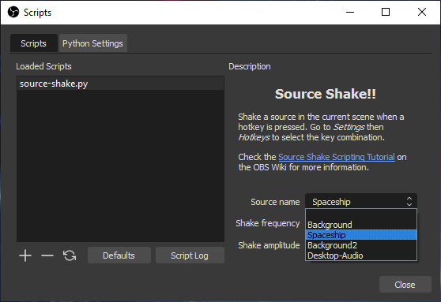

This page proposes a tutorial for Python and Lua scripting. As an educational example, we want to make a script that can "shake a source" when the user clicks on a hotkey. In other words, for a given source already present in OBS and displayed on the current scene, we want to continuously rotate it back and forth according to a given frequency and angular amplitude, such that the source jiggles, when the user presses a key continuously.

Depending how you came to this page, it is advisable now to take a look at the [OBS scripting documentation](https://obsproject.com/docs/scripting.html) and the [scripting introduction on the Wiki](Getting-Started-With-OBS-Scripting.md) if not already done.

### Hello World

Use a text editor and create a file named `source-shake.py` or `source-shake.lua` (both Python and Lua versions of the code will be given in the next sections). For now write only the following line in the file, which works for Python and Lua:

```python
print("Hello World!")
```

Add the file in the _Scripts_ dialog window, open the script log, you should see something like this:


Please note that `print` does the job but is not the best choice for logging, consider using [`blog`](https://obsproject.com/docs/reference-libobs-util-base.html?highlight=blog#c.blog) instead.

If it worked, you can remove the Hello World line from your file.

### Import of obspython or obslua

At the top of the script, insert some line(s) as following:

- In a Python script, it is mandatory to import the `obspython` module because the interpreter is not embedded. By convention, it is imported as `obs` (and we import already some additional Python modules):

``` Python
import obspython as obs
import math, time
```

- In Lua the `obslua` module is pre-imported, as well as the available standard modules. Again by convention, because it is shorter and some code snippets are then similar in Lua and Python, a global variable called `obs` usually references the module:

``` Lua
obs = obslua
```

### Script description

As a next step, create the function called `script_description` with no arguments, which is expected to return a character string containing the description of the script.

In Python:

``` Python
# Description displayed in the Scripts dialog window
def script_description():
  return """<center><h2>Source Shake!!</h2></center>
            <p>Shake a source in the current scene when a hotkey is pressed. Go to <em>Settings
            </em> then <em>Hotkeys</em> to select the key combination.</p><p>Check the <a href=
            "https://github.com/obsproject/obs-studio/wiki/Scripting-Tutorial-Source-Shake.md">
            Source Shake Scripting Tutorial</a> on the OBS Wiki for more information.</p>"""
```

In Lua:

``` Lua
-- Description displayed in the Scripts dialog window
function script_description()
  print("in script_description")
  return [[<center><h2>Source Shake!!</h2></center>
           <p>Shake a source in the current scene when a hotkey is pressed. Go to <em>Settings
           </em> then <em>Hotkeys</em> to select the key combination.</p><p>Check the <a href=
           "https://github.com/obsproject/obs-studio/wiki/Scripting-Tutorial-Source-Shake.md">
           Source Shake Scripting Tutorial</a> on the OBS Wiki for more information.</p>]]
end
```

After reloading the script, the description should now be displayed:


Please note that the description string is displayed by Qt, meaning that a [subset of HTML](https://doc.qt.io/qt-5/richtext-html-subset.html) can be used for formatting. A self-contained [Data URI](https://en.wikipedia.org/wiki/Data_URI_scheme) of a PNG or BMP file can be used as well to show a picture in the description.

### Source setup

At this point, set a source in OBS (an image, your webcam, whatever) and give it a name. For this tutorial, let's call the source "Spaceship" such that it is easily identifiable (adapt the name as convenient).

As we will rotate the source, it is better to have it centered. It is not absolutely necessary but the shake effect looks better if the source rotates around its center than around one of its corners.

To do it: select the source, right-click on it, _Transform_ > _Edit transform.._, for _Positional Alignment_ select _Center_, then _Close_ (changing the alignment will change the position of the source):


Please note that the "transform" of a source depends on its actual position in a given scene. The same source in another scene would have another transform linked to its "scene item" (more about that in the next section). One parameter is the "Rotation" that will be changed by the script.

### Finding the relevant OBS API functions

The basis is in place (we will come back to properties and hotkey later on) and we want to find out how to rotate the source. When writing code for OBS, a very time-consuming task is to browse the huge OBS API to determine which functions or combinations of functions are required to reach OBS data.

A [quick search for "rotation"](https://obsproject.com/docs/search.html?q=rotation) in the OBS API points out one promising function among many results: [`obs_sceneitem_set_rot`](https://obsproject.com/docs/reference-scenes.html?highlight=rotation#c.obs_sceneitem_set_rot) sets the rotation angle of a "scene item" ([`obs_sceneitem_get_rot`](https://obsproject.com/docs/reference-scenes.html?highlight=rotation#c.obs_sceneitem_get_rot) to retrieve the current angle). So actually we cannot directly rotate the source but only its embodiment in a scene, represented by a C structure with type `obs_sceneitem_t`.

On the same page of the OBS API, we can find the function [`obs_find_source`](https://obsproject.com/docs/reference-scenes.html?highlight=sceneitem#c.obs_scene_find_source), or even better the function [`obs_find_source_recursive`](https://obsproject.com/docs/reference-scenes.html?highlight=sceneitem#c.obs_scene_find_source_recursive) to scan groups too, which both return a pointer to an `obs_sceneitem_t` object from a scene and a source name.

Now how to find the current scene? Once again, a [search for "scene"](https://obsproject.com/docs/search.html?q=scene) gives the function [`obs_frontend_get_current_scene`](https://obsproject.com/docs/reference-frontend-api.html?highlight=scene#c.obs_frontend_get_current_scene) among the first hits. But the function returns a source (everything seems to be a source in OBS). The function [`obs_scene_from_source`](https://obsproject.com/docs/reference-scenes.html?highlight=scene#c.obs_scene_from_source), as well among the search results, makes the conversion.

:warning: `obs_frontend_get_current_scene` returns a "_new reference_ to the currently active scene". Like for some other functions, _new reference_ means that the data returned by the function needs to be explicitly released, here with [`obs_source_release`](https://obsproject.com/docs/reference-sources.html#c.obs_source_release). OBS will crash if the source is not released (as of OBS 26.1).

### Shake it

We know now how to find a scene item corresponding to a source in the current scene, how to change its rotation angle through several OBS functions, and from the [documentation of the "Script Function Exports"](https://obsproject.com/docs/scripting.html#script-function-exports) we know that `script_tick` is called every frame.

Time to write a quick and dirty animation function of "Spaceship", in Python:

``` Python
def script_tick(seconds):
  current_scene_as_source = obs.obs_frontend_get_current_scene()
  if current_scene_as_source:
    current_scene = obs.obs_scene_from_source(current_scene_as_source)
    scene_item = obs.obs_scene_find_source_recursive(current_scene, "Spaceship")
    if scene_item:
      obs.obs_sceneitem_set_rot(scene_item, 10*math.sin(12*time.time()))
    obs.obs_source_release(current_scene_as_source)
```

In Lua:

``` Lua
function script_tick(seconds)
  local current_scene_as_source = obs.obs_frontend_get_current_scene()
  if current_scene_as_source then
    local current_scene = obs.obs_scene_from_source(current_scene_as_source)
    local scene_item = obs.obs_scene_find_source_recursive(current_scene, "Spaceship")
    if scene_item then
      obs.obs_sceneitem_set_rot(scene_item, 10*math.sin(12*os.clock()))
    end
    obs.obs_source_release(current_scene_as_source)
  end
end
```

The animation depends on the time in seconds, implemented in the line `obs.obs_sceneitem_set_rot(scene_item, 10*math.sin(12*time.time()))` in Python, where `10` is the amplitude of the oscillations (&plusmn; 10 degrees) and `12` a frequency factor (for _12/2&pi;_ oscillations per second).

Add the function above, reload the script, and the animation should start:


Looks good!! Check how the _Edit Transform.._ window shows nicely the changes of rotation angle.

### Some re-factoring

The function defined in the previous section works well, is robust against some modifications of the source (moving, adding in another scene, etc) but is far from perfect:

- The scene item oscillates around the angle 0, overriding any pre-existing rotation set by the user
- There is no way to restore the source in its initial position after the animation, such that on exit OBS saves the source in a crooked position

So first of all, the initial rotation angle of the scene item needs to be stored before touching it, in order to restore everything when necessary (note that the angle will be used as well for the oscillations in the animation). A reference to the modified scene item is kept too.

We define the two new functions `save_sceneitem_for_shake` and `restore_sceneitem_after_shake` plus the related global variables, in Python:

``` Python
# Global variables to restore the scene item after shake
shaken_sceneitem = None     # Reference to the modified scene item
shaken_sceneitem_angle = 0  # Initial rotation angle, used as well for oscillations

# Saves the original rotation angle of the given sceneitem (assumed not None)
def save_sceneitem_for_shake(sceneitem):
  global shaken_sceneitem, shaken_sceneitem_angle
  shaken_sceneitem = sceneitem
  shaken_sceneitem_angle = obs.obs_sceneitem_get_rot(sceneitem)

# Restores the original rotation angle on the scene item after shake
def restore_sceneitem_after_shake():
  global shaken_sceneitem, shaken_sceneitem_angle
  if shaken_sceneitem:
    obs.obs_sceneitem_set_rot(shaken_sceneitem, shaken_sceneitem_angle)
    shaken_sceneitem = None
```

In Lua:

``` Lua
-- Global variables to restore the scene item after shake
shaken_sceneitem = nil     -- Reference to the modified scene item
shaken_sceneitem_angle = 0 -- Initial rotation angle, used as well for oscillations

-- Saves the original rotation angle of the given sceneitem (assumed not nil)
function save_sceneitem_for_shake(sceneitem)
  shaken_sceneitem = sceneitem
  shaken_sceneitem_angle = obs.obs_sceneitem_get_rot(sceneitem)
end

-- Restores the original rotation angle on the scene item after shake
function restore_sceneitem_after_shake()
  if shaken_sceneitem then
    obs.obs_sceneitem_set_rot(shaken_sceneitem, shaken_sceneitem_angle)
    shaken_sceneitem = nil
  end
end
```

Then we define a function to encapsulate the search for the scene item, mainly for code clarity. This function is self-contained so it can be re-used as is (no global variable involved), in Python:

``` Python
# Retrieves the scene item of the given source name in the current scene or None if not found
def get_sceneitem_from_source_name_in_current_scene(name):
  result_sceneitem = None
  current_scene_as_source = obs.obs_frontend_get_current_scene()
  if current_scene_as_source:
    current_scene = obs.obs_scene_from_source(current_scene_as_source)
    result_sceneitem = obs.obs_scene_find_source_recursive(current_scene, name)
    obs.obs_source_release(current_scene_as_source)
  return result_sceneitem
```

In Lua:

``` Lua
-- Retrieves the scene item of the given source name in the current scene or nil if not found
function get_sceneitem_from_source_name_in_current_scene(name)
  local result_sceneitem = nil
  local current_scene_as_source = obs.obs_frontend_get_current_scene()
  if current_scene_as_source then
    local current_scene = obs.obs_scene_from_source(current_scene_as_source)
    result_sceneitem = obs.obs_scene_find_source_recursive(current_scene, name)
    obs.obs_source_release(current_scene_as_source)
  end
  return result_sceneitem
end
```

Finally we define the main function `shake_source`, to be called in `script_tick`, that puts everything together and implements the animation. We search for the scene item at every frame in order to better follow changes triggered by the user. The logic is to animate the scene item if it can be found in the current scene, otherwise to restore any previously modified scene item. This is a rather naive approach because it assumes that restoring the initial angle is always possible whatever happened to the scene item in between (more about that in the next sections).

For simplicity in this tutorial, global variables are used directly by the functions (a more re-usable version of these functions should pass everything as arguments). Each script runs in its own context, so no interference with other scripts is expected. The global variables hold values that will be defined as editable properties in a later section: `source_name`, oscillation `frequency` and oscillation `amplitude`.

In Python, including the call in `script_tick`:

``` Python
# Global variables holding the values of data settings / properties
source_name = "Spaceship"  # Name of the source to shake
frequency = 2              # Frequency of oscillations in Hertz
amplitude = 10             # Angular amplitude of oscillations in degrees

# Animates the scene item corresponding to source_name in the current scene
def shake_source():
  sceneitem = get_sceneitem_from_source_name_in_current_scene(source_name)
  if sceneitem:
    id = obs.obs_sceneitem_get_id(sceneitem)
    if shaken_sceneitem and obs.obs_sceneitem_get_id(shaken_sceneitem) != id:
      restore_sceneitem_after_shake()
    if not shaken_sceneitem:
      save_sceneitem_for_shake(sceneitem)
    angle = shaken_sceneitem_angle + amplitude*math.sin(time.time()*frequency*2*math.pi)
    obs.obs_sceneitem_set_rot(sceneitem, angle)
  else:
    restore_sceneitem_after_shake()

# Called every frame
def script_tick(seconds):
  shake_source()
```

In Lua:

``` Lua
-- Animates the scene item corresponding to source_name in the current scene
function shake_source()
  local sceneitem = get_sceneitem_from_source_name_in_current_scene(source_name)
  if sceneitem then
    local id = obs.obs_sceneitem_get_id(sceneitem)
    if shaken_sceneitem and obs.obs_sceneitem_get_id(shaken_sceneitem) ~= id then
      restore_sceneitem_after_shake()
    end
    if not shaken_sceneitem then
      save_sceneitem_for_shake(sceneitem)
    end
    local angle = shaken_sceneitem_angle + amplitude*math.sin(os.clock()*frequency*2*math.pi)
    obs.obs_sceneitem_set_rot(sceneitem, angle)
  else
    restore_sceneitem_after_shake()
  end
end

-- Called every frame
function script_tick(seconds)
  shake_source()
end
```

Adapt the code, reload the script, and you should have the same behavior as in the previous section. Please note that we can call `restore_sceneitem_after_shake` at any time (provided the shaken scene item is still there), the next call to `shake_source` would re-initialize everything transparently and advance the animation.

### Handling script reload

The function `restore_sceneitem_after_shake` defined in the previous section will be helpful to manage the various events occurring in OBS, by restoring the original angle at the right time. Switching between scenes or renaming the source work fine, the original angle is restored properly. But if you try to reload the script, then you will see that the orientation of the animated source is lost, and diverges almost randomly with each new script reload.

This point is easy to solve, we just restore the angle in `script_unload`, part of the [global script functions](https://obsproject.com/docs/scripting.html#script-function-exports).

In Python:

``` Python
# Called at script unload
def script_unload():
  restore_sceneitem_after_shake()
```

In Lua:

``` Lua
-- Called at script unload
function script_unload()
  restore_sceneitem_after_shake()
end
```

Once the function is in place, reloading the script is just transparent, no visible effect on the shake animation. At this point you may want to edit the transform of the source(s) and restore the initial rotation angle by hand. Just rename the source temporarily to be able to edit the angle if the script is still active.

### Handling OBS exit

Even with the restore added in `script_unload`, the same kind of issue remains when OBS is closed: at next OBS start the orientation of the source is almost random. This event is a bit more difficult to handle because `script_unload` and `script_save` (called only upon OBS exit) are called after the scene data is saved, hence restoring the angle in these functions is too late.

One possible solution is to force again to save the sources in `script_save` using [`obs_save_sources`](https://obsproject.com/docs/reference-core.html#c.obs_save_sources), in Python:

``` Python
# Called before data settings are saved
def script_save(settings):
  restore_sceneitem_after_shake()
  obs.obs_save_sources()
```

In Lua:

``` Lua
-- Called before data settings are saved
function script_save(settings)
  restore_sceneitem_after_shake()
  obs.obs_save_sources()
end
```

### Handling scene item deletion

We are now done with saving and restoring the angle, all events should be covered, but there is still a quite nasty thing to handle: if the scene item is deleted by the user, the related C object is freed and trying to restore its angle with `restore_sceneitem_after_shake` may lead to an OBS crash! The issue may not be visible at all, depending on actual memory management and other allocated objects.

Fortunately, OBS provides a [sophisticated set of scene signals](https://obsproject.com/docs/reference-scenes.html#scene-signals) to handle such events, one of them is `item_remove`. It is not well documented but the callback of this signal is called _before_ the object is finally destroyed, as of OBS 26.1 (need to add logging in `obs_sceneitem_destroy` in `obs-scene.c` and recompile OBS to really check this behavior..).

We will use [`signal_handler_connect`](https://obsproject.com/docs/scripting.html#signal_handler_connect) to setup a callback in `save_sceneitem_for_shake` (with some additional function te re-determine the scene as source to get the signal handler). We keep a reference to the signal handler as a global variable to later disconnect the signal in `restore_sceneitem_after_shake`, in Python the save/restore part becomes:

``` Python
# Global variables to restore the scene item after shake
shaken_sceneitem = None     # Reference to the modified scene item
shaken_sceneitem_angle = 0  # Initial rotation angle, used as well for oscillations
shaken_scene_handler = None # Signal handler of the scene kept to restore

# Callback for item_remove signal
def on_shaken_sceneitem_removed(calldata):
  print("in on_shaken_sceneitem_removed")
  restore_sceneitem_after_shake()

# Saves the original rotation angle of the given sceneitem and connects item_remove signal
def save_sceneitem_for_shake(sceneitem):
  global shaken_sceneitem, shaken_sceneitem_angle, shaken_scene_handler
  shaken_sceneitem = sceneitem
  shaken_sceneitem_angle = obs.obs_sceneitem_get_rot(sceneitem)

  # Handles scene item deletion
  scene_as_source = obs.obs_scene_get_source(obs.obs_sceneitem_get_scene(sceneitem))
  shaken_scene_handler = obs.obs_source_get_signal_handler(scene_as_source)
  obs.signal_handler_connect(shaken_scene_handler, "item_remove", on_shaken_sceneitem_removed)

# Restores the original rotation angle on the scene item and disconnects item_remove signal
def restore_sceneitem_after_shake():
  global shaken_sceneitem, shaken_sceneitem_angle
  if shaken_sceneitem:
    obs.obs_sceneitem_set_rot(shaken_sceneitem, shaken_sceneitem_angle)

    obs.signal_handler_disconnect(shaken_scene_handler, "item_remove", on_shaken_sceneitem_removed)

    shaken_sceneitem = None
```

In Lua:

``` Lua
-- Global variables to restore the scene item after shake
shaken_sceneitem = nil     -- Reference to the modified scene item
shaken_sceneitem_angle = 0 -- Initial rotation angle, used as well for oscillations
shaken_scene_handler = nil -- Signal handler of the scene kept to restore

-- Callback for item_remove signal
function on_shaken_sceneitem_removed(calldata)
  restore_sceneitem_after_shake()
end

-- Saves the original rotation angle of the given sceneitem and connects item_remove signal
function save_sceneitem_for_shake(sceneitem)
  shaken_sceneitem = sceneitem
  shaken_sceneitem_angle = obs.obs_sceneitem_get_rot(sceneitem)

  -- Handles scene item deletion
  local scene_as_source = obs.obs_scene_get_source(obs.obs_sceneitem_get_scene(sceneitem))
  shaken_scene_handler = obs.obs_source_get_signal_handler(scene_as_source)
  obs.signal_handler_connect(shaken_scene_handler, "item_remove", on_shaken_sceneitem_removed)
end

-- Restores the original rotation angle on the scene item and disconnects item_remove signal
function restore_sceneitem_after_shake()
  if shaken_sceneitem then
    --print("Restoring scene item with ID=" .. tostring(obs.obs_sceneitem_get_id(shaken_sceneitem)))
    obs.obs_sceneitem_set_rot(shaken_sceneitem, shaken_sceneitem_angle)

    obs.signal_handler_disconnect(shaken_scene_handler, "item_remove", shaken_sceneitem_remove_callback)

    shaken_sceneitem = nil
  end
end
```

### Properties and data settings

Time to add real functionality again after several sections about management of corner conditions.

Until now the parameters of the animation are only stored in global variables .They should be customizable by the user. OBS provides a large set of functions to manage user settings, based on two main objects:

- [Data Settings](https://obsproject.com/docs/reference-settings.html) hold the values, support default values and are automatically saved by OBS for scripts
- [Properties](https://obsproject.com/docs/reference-properties.html) build the GUI to modify data settings

The global script functions of interest are:

- **`script_defaults(settings)`** to set default values using functions such as [`obs_data_set_default_string(settings, name, value)`](https://obsproject.com/docs/reference-settings.html#c.obs_data_set_default_string), where `settings` is the data settings object and `name` the name of the user setting parameter
- **`script_properties()`** to build the GUI using functions such as [`obs_properties_add_text(props, name, description, type)`](https://obsproject.com/docs/reference-properties.html#c.obs_properties_add_text), where `props` is the properties object, `name` the name of the related user setting parameter, `description` an HTML short description of the parameter and `type` the type of text entry field (here classical single line string)
- **`script_update(settings)`** to transfer the modified values of data settings parameters to the relevant variables using functions such as [`obs_data_get_string(settings, name)`](https://obsproject.com/docs/reference-settings.html#c.obs_data_get_string) to retrieve values from the data settings object

As a kind of convention in this tutorial, the same names are used for global variables and for the related data settings parameters. The property objects take care of updating the values of the data settings if changed by the user, and the values are stored persistently without additional effort. The code is straightforward, in Python:

``` Python
# Called to set default values of data settings
def script_defaults(settings):
  obs.obs_data_set_default_string(settings, "source_name", "")
  obs.obs_data_set_default_double(settings, "frequency", 2)
  obs.obs_data_set_default_int(settings, "amplitude", 10)

# Called to display the properties GUI
def script_properties():
  props = obs.obs_properties_create()
  obs.obs_properties_add_text(props, "source_name", "Source name", obs.OBS_TEXT_DEFAULT)
  obs.obs_properties_add_float_slider(props, "frequency", "Shake frequency", 0.1, 20, 0.1)
  obs.obs_properties_add_int_slider(props, "amplitude", "Shake amplitude", 0, 90, 1)
  return props

# Called after change of settings including once after script load
def script_update(settings):
  global source_name, frequency, amplitude
  restore_sceneitem_after_shake()
  source_name = obs.obs_data_get_string(settings, "source_name")
  frequency = obs.obs_data_get_double(settings, "frequency")
  amplitude = obs.obs_data_get_int(settings, "amplitude")
```

In Lua:

``` Lua
-- Called to set default values of data settings
function script_defaults(settings)
  obs.obs_data_set_default_string(settings, "source_name", "")
  obs.obs_data_set_default_double(settings, "frequency", 2)
  obs.obs_data_set_default_int(settings, "amplitude", 10)
end

-- Called to display the properties GUI
function script_properties()
  props = obs.obs_properties_create()
  obs.obs_properties_add_text(props, "source_name", "Source name", obs.OBS_TEXT_DEFAULT)
  obs.obs_properties_add_float_slider(props, "frequency", "Shake frequency", 0.1, 20, 0.1)
  obs.obs_properties_add_int_slider(props, "amplitude", "Shake amplitude", 0, 90, 1)
  return props
end

-- Called after change of settings including once after script load
function script_update(settings)
  restore_sceneitem_after_shake()
  source_name = obs.obs_data_get_string(settings, "source_name")
  frequency = obs.obs_data_get_double(settings, "frequency")
  amplitude = obs.obs_data_get_int(settings, "amplitude")
end
```

Please note that there is always a slight difference between GUI-related properties and data settings in the OBS API. For example, a decimal number is named `double` in data settings while the GUI element is a `float_slider` (with a min, max and step to guide the user). A `string` in data settings is edited with a `text` property on the GUI.

Once the code is updated, reload the script, enter the name of the source, and then properties can be modified live:


### Drop-down list of sources

In the previous section, the `obs_properties_add_text` function has been introduced to let the user enter the name of the source manually. Obviously, as OBS knows all source names, any user would expect that the source can be selected in a drop-down list.

A drop-down list property is implemented through the function [`obs_properties_add_list`](https://obsproject.com/docs/reference-properties.html#c.obs_properties_add_list) that returns a list `property` object. In our case it will be non-editable (`OBS_COMBO_TYPE_LIST`) and used to select a string data type (`OBS_COMBO_FORMAT_STRING`).

Once the drop-down list property exists, it must be filled with selectable entries using [`obs_property_list_add_string`](https://obsproject.com/docs/reference-properties.html#c.obs_property_list_add_string). A selectable entry is always a pair of displayed value (`name` argument of `obs_property_list_add_string`, visible to the user) and encoded value (`val`, used for processing). In our case, both values are the same.

Existing sources in OBS are enumerated with the script-specific function [`obs_enum_sources`](https://obsproject.com/docs/scripting.html#obs_enum_sources). It returns a Python/Lua array of references to source objects. We use [`obs_source_get_name`](https://obsproject.com/docs/reference-sources.html#c.obs_source_get_name) to retrieve the name of each source. At the end, [`source_list_release`](https://obsproject.com/docs/scripting.html#source_list_release) must be used to release allocated objects.

In the function `script_properties`, replace the line starting with `obs.obs_properties_add_text` with the following block, in Python:

``` Python
  sources = obs.obs_enum_sources()
  p = obs.obs_properties_add_list(props, "source_name", "Source name",
              obs.OBS_COMBO_TYPE_LIST, obs.OBS_COMBO_FORMAT_STRING)
  for source in sources:
    name = obs.obs_source_get_name(source)
    obs.obs_property_list_add_string(p, name, name)
  obs.source_list_release(sources)
```

In Lua:

``` Lua
  local sources = obs.obs_enum_sources()
  local p = obs.obs_properties_add_list(props, "source_name", "Source name",
              obs.OBS_COMBO_TYPE_LIST, obs.OBS_COMBO_FORMAT_STRING)
  for _,source in pairs(sources) do
    local name = obs.obs_source_get_name(source)
    obs.obs_property_list_add_string(p, name, name)
  end
  obs.source_list_release(sources)
```

Update the code, reload the scripts, then the drop-down list should be visible:




### Activate animation with a hotkey

:boom: to be written

---

#### Template formatting

In Python:

``` Python
```

In Lua:

``` Lua
```


In Python:

``` Python
```

In Lua:

``` Lua
```

