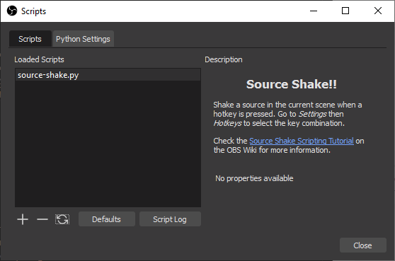

This page proposes a tutorial for Python and Lua scripting. As an educational example, we want to make a script that can "shake a source". In other words, for a given source already present in OBS and displayed on the current scene, we want to continuously rotate it back and forth according to a given frequency and angular amplitude, such that the source jiggles.

Depending how you came to this page, it is advisable to take a look at the [OBS scripting documentation](https://obsproject.com/docs/scripting.html) if not already done.

### Hello World

Use a text editor and create a file named `source-shake.py` or `source-shake.lua` (both Python and Lua versions of the code will be given in the next sections). For now write only the following line in the file, which works for Python and Lua:

```python
print("Hello World!")
```

Add the file in the _Scripts_ dialog window, open the script log, you should see something like this:


Please note that `print` does the job but is not the best choice for logging, consider using [`blog`](https://obsproject.com/docs/reference-libobs-util-base.html?highlight=blog#c.blog) instead.

If it worked, you can remove the Hello World line from your file.

### Import of obspython or obslua

At the top of the script, insert some line(s) as following:

- In a Python script, it is mandatory to import the `obspython` module because the interpreter is not embedded. By convention, it is imported as `obs` (and we import already some additional Python modules):

``` Python
import obspython as obs
import math, time
```

- In Lua the `obslua` module is pre-imported, as well as the available standard modules. Again by convention, because it is shorter and some code snippets are then similar in Lua and Python, a global variable called `obs` usually references the module:

``` Lua
obs = obslua
```

### Script description

As a next step, create the function called `script_description` with no arguments, which returns a character string with the description.

In Python:

``` Python
# Description displayed in the Scripts dialog window
def script_description():
  return """<center><h2>Source Shake!!</h2></center>
            <p>Shakes the given source according to the given frequency and amplitude.</p><p>See the
            <a href="https://github.com/obsproject/obs-studio/wiki/Getting-Started-With-OBS-Scripting">
            Scripting Wiki page</a> for details on the Python code.</p>"""

```

In Lua:

``` Lua
-- Description displayed in the Scripts dialog window
function script_description()
  return [[<center><h2>Source Shake!!</h2></center>
           <p>Shakes the given source according to the given frequency and amplitude.</p><p>See the
           <a href="https://github.com/obsproject/obs-studio/wiki/Getting-Started-With-OBS-Scripting">
           Scripting Wiki page</a> for details on the Lua code.</p>]]
end
```

After reloading the scripts, the description should now be displayed:



Please note that the description string is displayed by Qt, meaning that a [subset of HTML](https://doc.qt.io/qt-5/richtext-html-subset.html) can be used for formatting. A self-contained [Data URI](https://en.wikipedia.org/wiki/Data_URI_scheme) of a PNG or BMP file can be used as well to show a picture in the description.


### Source setup

At this point, set a source in OBS (an image, your webcam, whatever) and give it a name. For this tutorial, let's call the source "Spaceship" such that it is easily identifiable (adapt the name as convenient).

As we will rotate the source, it is better to have it centered. It is not mandatory but the shake effect looks better if the source rotates around its center than around one of its corners.

To do it: select the source, right-click on it, _Transform_ > _Edit transform.._, for _Positional Alignment_ select _Center_, then _Close_ (changing the alignment will change the position of the source):


Please note that the "transform" of a source depends on its actual position in a given scene. The same source in another scene would have another transform. Note as well the the title of the window _Scene Item Transform_ (more on that in the next section). One parameter here is the "Rotation", which will be changed by the script.

### Finding and rotating the scene item

The basis is in place (we will come back to properties later on) and we want to find how to rotate the source.

A [quick search for "rotation"](https://obsproject.com/docs/search.html?q=rotation) in the OBS API points out one promising function among many results: [`obs_sceneitem_set_rot`](https://obsproject.com/docs/reference-scenes.html?highlight=rotation#c.obs_sceneitem_set_rot) sets the rotation angle of a "scene item" ([`obs_sceneitem_get_rot`](https://obsproject.com/docs/reference-scenes.html?highlight=rotation#c.obs_sceneitem_get_rot) to retrieve the current angle). So actually we cannot directly rotate the source but only its embodiment in a scene, represented by a C structure with type `obs_sceneitem_t`.

On the same page of the OBS API, we can find the function [`obs_find_source`](https://obsproject.com/docs/reference-scenes.html?highlight=sceneitem#c.obs_scene_find_source), or even better the function [`obs_find_source_recursive`](https://obsproject.com/docs/reference-scenes.html?highlight=sceneitem#c.obs_scene_find_source_recursive), which both return a pointer to an `obs_sceneitem_t` object from a scene and a source name, even if hidden in groups for the "recursive" variant.

Now how to find the current scene: once again, a [search for "scene"](https://obsproject.com/docs/search.html?q=scene) gives the function [`obs_frontend_get_current_scene`](https://obsproject.com/docs/reference-frontend-api.html?highlight=scene#c.obs_frontend_get_current_scene) among the first hits. But the function returns a source (everything seems to be a source in OBS). The function [`obs_scene_from_source`](https://obsproject.com/docs/reference-scenes.html?highlight=scene#c.obs_scene_from_source), as well among the search results, makes the conversion.

Let's put everything together. As there is no backup of the original angle set by the user, we need to carefully store the initial angle value to be able to restore the source in its original state. We need 3 functions to:

- retrieve and keep the reference to the scene item (if the related source name can be found at all) and save the initial rotation angle
- change the rotation angle according to the current time, frequency and amplitude for the shake effect
- restore the angle to its initial value

For simplicity in this tutorial, global variables are used to store script states. As each script runs in its own context, no interference with other scripts is expected (a more re-usable version of these functions should pass everything as arguments). The Python code looks like:

``` Python
# Name of the source to shake
source_name = "Spaceship"

# Kept reference to scene item
sceneitem = None

# Initial rotation angle
initial_angle = 0

# Frequency of oscillations in Hertz
frequency = 2

# Angular amplitude of oscillations in degrees
amplitude = 10

# Retrieves the scene item corresponding to source_name in the current scene and stores it in sceneitem,
# then stores its initial rotation angle in initial_angle. If the source cannot be found then sceneitem
# is set to None. If any sceneitem was previously initialized then restores its initial rotation angle.
def init_sceneitem_for_shake():
  global sceneitem, initial_angle
  if sceneitem:
    restore_sceneitem_after_shake()
  current_scene = obs.obs_scene_from_source(obs.obs_frontend_get_current_scene())
  sceneitem = obs.obs_scene_find_source_recursive(current_scene, source_name)
  if sceneitem:
    initial_angle = obs.obs_sceneitem_get_rot(sceneitem)

# Sets the rotation angle of sceneitem, if previously initialized, to a time-dependent oscillation
def shake_sceneitem():
  if sceneitem:
    new_angle = initial_angle + amplitude*math.sin(time.time()*frequency*2*math.pi)
    obs.obs_sceneitem_set_rot(sceneitem, new_angle)

# Restores the initial angle of sceneitem, if previously initialized, then sets sceneitem to None
def restore_sceneitem_after_shake():
  global sceneitem, initial_angle
  if sceneitem:
    obs.obs_sceneitem_set_rot(sceneitem, initial_angle)
    sceneitem = None
```

In Lua:

``` Lua
-- Name of the source to shake
source_name = "Spaceship"

-- Kept reference to scene item
sceneitem = nil

-- Initial rotation angle
initial_angle = 0

-- Frequency of oscillations in Hertz
frequency = 2

-- Angular amplitude of oscillations in degrees
amplitude = 10

-- Retrieves the scene item corresponding to source_name in the current scene and stores it in sceneitem,
-- then stores its initial rotation angle in initial_angle. If the source cannot be found then sceneitem
-- is set to nil. If any sceneitem was previously initialized then restores its initial rotation angle.
function init_sceneitem_for_shake()
  if sceneitem then
    restore_sceneitem_after_shake()
  end
  local current_scene = obs.obs_scene_from_source(obs.obs_frontend_get_current_scene())
  sceneitem = obs.obs_scene_find_source_recursive(current_scene, source_name)
  if sceneitem then
    initial_angle = obs.obs_sceneitem_get_rot(sceneitem)
  end
end

-- Sets the rotation angle of sceneitem, if previously initialized, to a time-dependent oscillation
function shake_sceneitem()
  if sceneitem then
    local new_angle = initial_angle + amplitude*math.sin(os.clock()*frequency*2*math.pi)
    obs.obs_sceneitem_set_rot(sceneitem, new_angle)
  end
end

-- Restores the initial angle of sceneitem, if previously initialized, then sets sceneitem to nil
function restore_sceneitem_after_shake()
  if sceneitem then
    obs.obs_sceneitem_set_rot(sceneitem, initial_angle)
    sceneitem = nil
  end
end
```

The functions are put into action in the next section.

### Animation

The different [global script functions](https://obsproject.com/docs/scripting.html#script-function-exports) are defined to let code be executed at different stages of the life-cycle of the script. In our case, the following script functions are interesting:

- **`script_update(settings)`** is a good place for initialization as it is called after any settings change, including once after script load (`settings` is the data settings object, more about that later on)
- **`script_tick(seconds)`** is an obvious choice for the animation, called every frame (`seconds` is the number of seconds passed since the previous frame)
- **`script_unload()`** is one of the places where restoring the original source state makes sense (more about that later on)

The code is then straightforward, in Python:

``` Python
# Called after change of settings including once after script load
def script_update(settings):
  init_sceneitem_for_shake()

# Called every frame
def script_tick(seconds):
  shake_sceneitem()

# Called at script unload
def script_unload():
  restore_sceneitem_after_shake()
```

In Lua:

``` Lua
-- Called after change of settings including once after script load
function script_update(settings)
  init_sceneitem_for_shake()
end

-- Called every frame
function script_tick(seconds)
  shake_sceneitem()
end

-- Called at script unload
function script_unload()
  restore_sceneitem_after_shake()
end
```

Adapt the code, reload the scripts, and the animation should start:


The _Edit Transform.._ window shows nicely the changes of rotation angle.

### Fixes for OBS start and stop

The script seems to work as expected as long as OBS is running, i.e. it can be detached, re-attached, reloaded, etc. But a significant flaw remains: at OBS startup the effect does not start automatically (at least a script reload is necessary) and a crash may occur when OBS is closed (followed by a crash when OBS is started again, recovered by a second start, the exact behavior may differ with a later version of OBS).

This misbehavior is due to the early initialization of scripts during the OBS startup, before the scenes and sources are set up, and late unloading.

For the startup, an event 


### Properties and data settings

Until now the parameters of the animation are only stored in global variables, time to make them customizable by the user. OBS provides a large set of functions to manage user settings, based on two main objects:

- [Data Settings](https://obsproject.com/docs/reference-settings.html) hold the values, support default values and are automatically saved by OBS for scripts
- [Properties](https://obsproject.com/docs/reference-properties.html) build the GUI to modify data settings

The global script functions of interest are:

- **`script_defaults(settings)`** to set default values using functions such as [`obs_data_set_default_string(settings, name, value)`](https://obsproject.com/docs/reference-settings.html#c.obs_data_set_default_string), where `settings` is the data settings object and `name` the name of the user setting parameter
- **`script_properties()`** to build the GUI using functions such as [`obs_properties_add_text(props, name, description, type)`](https://obsproject.com/docs/reference-properties.html#c.obs_properties_add_text), where `props` is the properties object, `name` the name of the related user setting parameter, `description` an HTML short description of the parameter and `type` the type of text entry field (here classical single line string)
- **`script_update(settings)`** to transfer the modified values of data settings parameters to the relevant variables using functions such as [`obs_data_get_string(settings, name)`](https://obsproject.com/docs/reference-settings.html#c.obs_data_get_string) to retrieve values from the data settings object

By convention, the same names can be used for global variables and for the data settings parameters. Properties GUI elements will use the name to update the values of the related data settings parameters in place, no need for additional update. Many things happen under the hood, including the persistent storage.

One difficulty here is the slight difference between GUI-related properties and data settings. For instance, a decimal number is named `double` in data settings while the GUI element is a `float_slider` (with a min, max and step to guide the user). A `string` in data settings is edited with a `text` property on the GUI.

Add the functions and redefine `script_update` as following, in Python:

``` Python
# Called to set default values of data settings
def script_defaults(settings):
  obs.obs_data_set_default_string(settings, "source_name", "")
  obs.obs_data_set_default_double(settings, "frequency", 2)
  obs.obs_data_set_default_int(settings, "amplitude", 10)

# Called to display the properties GUI
def script_properties():
  props = obs.obs_properties_create()
  obs.obs_properties_add_text(props, "source_name", "Source name", obs.OBS_TEXT_DEFAULT)
  obs.obs_properties_add_float_slider(props, "frequency", "Shake frequency", 0.1, 20, 0.1)
  obs.obs_properties_add_int_slider(props, "amplitude", "Shake amplitude", 0, 90, 1)
  return props

# Called after change of settings including once after script load
def script_update(settings):
  global source_name, frequency, amplitude
  source_name = obs.obs_data_get_string(settings, "source_name")
  frequency = obs.obs_data_get_double(settings, "frequency")
  amplitude = obs.obs_data_get_int(settings, "amplitude")
  init_sceneitem_for_shake()
```

In Lua:

``` Lua
-- Called to set default values of data settings
function script_defaults(settings)
  obs.obs_data_set_default_string(settings, "source_name", "")
  obs.obs_data_set_default_double(settings, "frequency", 2)
  obs.obs_data_set_default_int(settings, "amplitude", 10)
end

-- Called to display the properties GUI
function script_properties()
  local props = obs.obs_properties_create()
  obs.obs_properties_add_text(props, "source_name", "Source name", obs.OBS_TEXT_DEFAULT)
  obs.obs_properties_add_float_slider(props, "frequency", "Shake frequency", 0.1, 20, 0.1)
  obs.obs_properties_add_int_slider(props, "amplitude", "Shake amplitude", 0, 90, 1)
  return props
end

-- Called after change of settings including once after script load
function script_update(settings)
  source_name = obs.obs_data_get_string(settings, "source_name")
  frequency = obs.obs_data_get_double(settings, "frequency")
  amplitude = obs.obs_data_get_int(settings, "amplitude")
  init_sceneitem_for_shake()
end
```

Once the code is updated, reload the scripts, enter the name of the source, and then properties can be modified live:


### Drop-down list of sources

In the previous section, the `obs_properties_add_text` function has been introduced to let the user enter the name of the source manually. Obviously, as OBS knows all source names, any user would expect that the source can be selected in a drop-down list.

A drop-down list property is implemented through the function [`obs_properties_add_list`](https://obsproject.com/docs/reference-properties.html#c.obs_properties_add_list) that returns a list `property` object. In our case it will be non-editable (`OBS_COMBO_TYPE_LIST`) and used to select a string data type (`OBS_COMBO_FORMAT_STRING`).

Once the drop-down list property exists, it must be filled with selectable entries using [`obs_property_list_add_string`](https://obsproject.com/docs/reference-properties.html#c.obs_property_list_add_string). A selectable entry is always a pair of displayed value (`name` argument of `obs_property_list_add_string`, visible to the user) and encoded value (`val`, used for processing). In our case, both values are the same.

Existing sources in OBS are enumerated with the script-specific function [`obs_enum_sources`](https://obsproject.com/docs/scripting.html#obs_enum_sources). It returns a Python/Lua array of references to source objects. We use [`obs_source_get_name`](https://obsproject.com/docs/reference-sources.html#c.obs_source_get_name) to retrieve the name of each source. At the end, [`source_list_release`](https://obsproject.com/docs/scripting.html#source_list_release) must be used to release allocated objects.

In the function `script_properties`, replace the line starting with `obs.obs_properties_add_text` with the following block, in Python:

``` Python
  sources = obs.obs_enum_sources()
  p = obs.obs_properties_add_list(props, "source_name", "Source name",
              obs.OBS_COMBO_TYPE_LIST, obs.OBS_COMBO_FORMAT_STRING)
  for source in sources:
    name = obs.obs_source_get_name(source)
    obs.obs_property_list_add_string(p, name, name)
  obs.source_list_release(sources)
```

In Lua:

``` Lua
  local sources = obs.obs_enum_sources()
  local p = obs.obs_properties_add_list(props, "source_name", "Source name",
              obs.OBS_COMBO_TYPE_LIST, obs.OBS_COMBO_FORMAT_STRING)
  for _,source in pairs(sources) do
    local name = obs.obs_source_get_name(source)
    obs.obs_property_list_add_string(p, name, name)
  end
  obs.source_list_release(sources)
```

Update the code, reload the scripts, then the drop-down list should be visible:


### Activate animation with a hotkey

---

#### Template formatting

In Python:

``` Python
```

In Lua:

``` Lua
```

