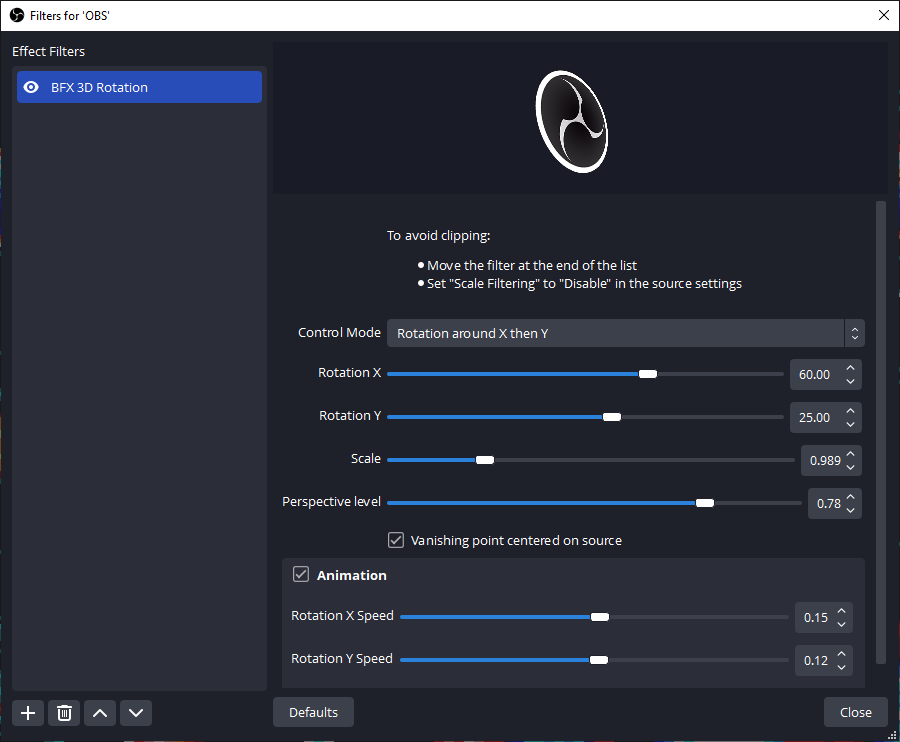
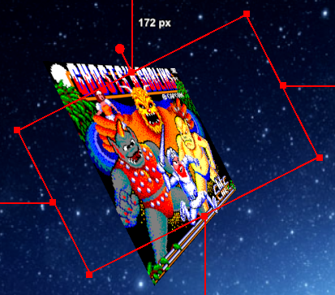
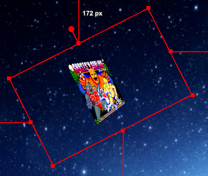
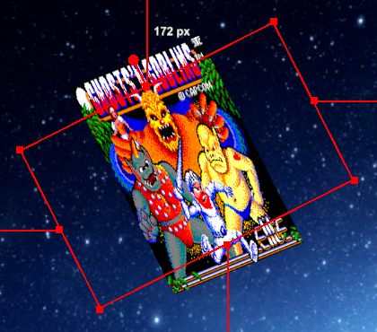
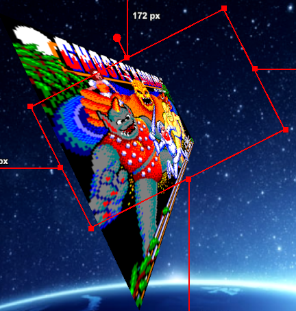
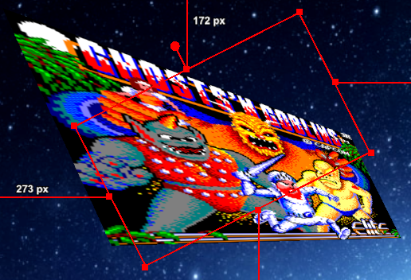

# BFX 3D Rotation Filter

This Lua script provides a filter called "BFX 3D Rotation", which can be added to a source to display it like a 3D object in space.

Main features:

- Very low GPU/CPU usage as the computation is only done at vertex level
- Rotations around X and Y axes (the rotation in the Transform can be used as third rotation)
- Several rotation control modes: around X-then-Y or Y-then-X or around an arbitrary axis
- Perspective strength configurable in one single parameter, from orthographic projection to extreme perspective deformation
- _Animation_ through variation of the rotation parameters at configurable speeds

## Settings

The parameters of the filter are:

- **Control Mode**: 3 different modes to control the rotation:
  - _Rotation around X then Y_: classical rotation around the X axis (top-bottom) then around the Y axis (left-right)
  - _Rotation around Y then X_: classical rotation around the Y axis then around the X axis
  - _Rotation around axis in XY plane_: rotation around an arbitrary axis located in the plane of the source (XY plane). The axis is defined only by its angle.
- **Rotation X** and **Rotation Y**: Rotation angles for a classical rotation
- **Rotation Angle**: Rotation angle around the arbitrary axis
- **Axis Angle**: Orientation angle of the arbitrary axis

The different control modes with the related parameters are just different ways to rotate the source picture around the X and Y axes only. An additional rotation of the Transform can be used as well for the rotation around the Z axis:

- **Scale**: Zoom factor

Example of scale with a low value:

- **Perspective Level**: Strength of the perspective effect, from $0$ for an orthographic projection to $1$ for a strong perspective deformation

Perspective level at $0$ (orthographic):

Perspective level at $1$:

- **Vanishing point centered on source**: Flag to control how the perspective is calculated:
  - Activated: the center of the perspective (or vanishing point) is _centered on the source_. In this mode the perspective deformation does not depend on the position of the source on the screen and the deformation is symmetrical.
  - Deactivated: the center of the perspective is located on the _center of the screen_ and the deformation is oriented towards this point. The deformation is slightly changed when the source is moved on the screen. This mode can be used to set up several sources on the same scene sharing a coherent perspective.

Example of vanishing point on the center of the screen (flag deactivated):

- **Animation**: Flag to activate the animation and make the speed values editable. The speeds are defined according to the selected Control Mode, i.e. either rotation speed  around the X and Y axes, or speed of the rotation angle around the arbitrary axis and rotation speed of the axis itself.

Example of animation with a low speed on the angle of the arbitrary axis while keeping constant the rotation angle around this axis:

