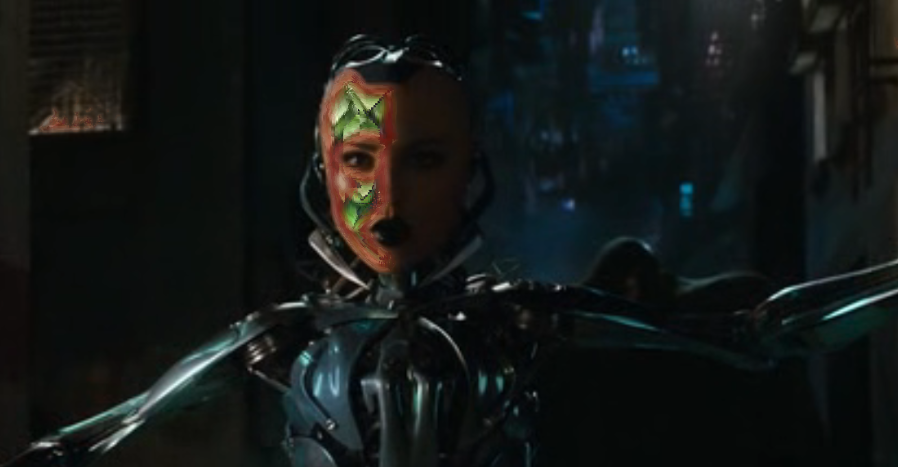

# BFX Texture Skin filter

[filter-texture-skin.lua](filter-texture-skin.lua) Lua script for OBS selects a particular set of colors according to HSV intervals and replaces it with a texture.

It supports:

- Color selection using min/max ranges in HSV color space
- Outline of given width and color, with 2 mode: solid color or smooth
- 4 effect modes: jiggle (no texture), flat static, rounded static, rounded moving
- Different alpha values to combine with other effects
- User-defined texture with texture scale

It is a classical filter in OBS:

By tweaking parameters, interesting reptile-style skin effects can be obtained, here with a smooth red outline:

Some neon-like effect with a solid outline mixed with the original color:

