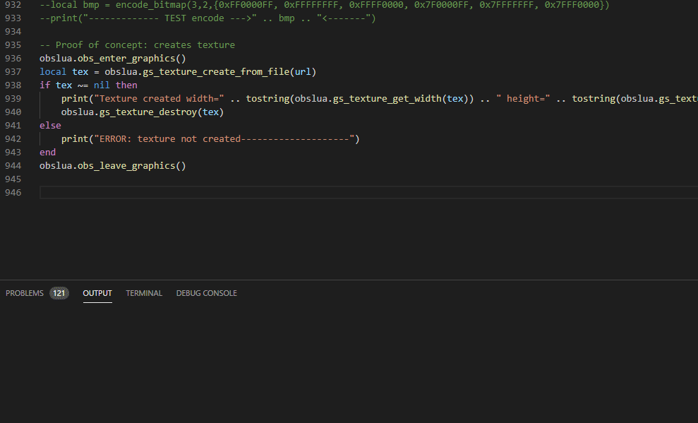
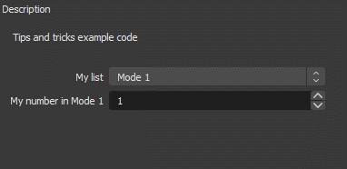
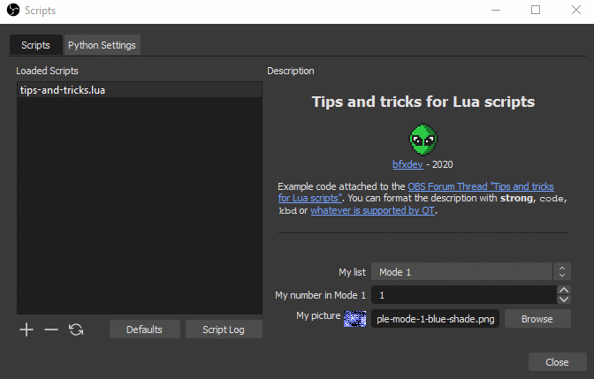

# Some work on Lua and Python scripting in OBS

OBS supports scripting, which is a wonderful playground to experiment with video effects and shaders. The files in this folder provide some information about the scripting implementation in OBS mainly to ease development.

## Lua IDE support

The Lua/Python scripting environment of OBS is very powerful but is lacking proper documentation. The API documentation of OBS describes the C structures and functions but not the exact way the bindings are implemented.

[generate-obslua-support-files.lua](generate-obslua-support-files.lua) is a Lua script that generates a documentation file **[obslua.html](obslua.html)** and a definition file **[obslua.lua](obslua.lua)** by parsing the OBS text documentation and a SWIG generated file.

The main purpose of the Lua definition file is to ease development in an IDE such as Visual Studio Code by supporting contextual help by hovering and auto-completion. Use it in VS Code with [sumneko's Lua Language Server extension](https://marketplace.visualstudio.com/items?itemName=sumneko.lua). It relies on [EmmyLua-style annotations](https://emmylua.github.io).

It is important to change the settings of the Lua Language Server extension such that, for VS Code:

- The size limitation of input files is set to a higher value, e.g. `"Lua.workspace.preloadFileSize": 10000,`
- The file is in the list of workspace libraries (here the files is stored in the root folder of the VS Code workspace):

```JSON
"Lua.workspace.library": {
        ".../obslua.lua": true
    },
```

- LuaJIT is set as Lua version `"Lua.runtime.version": "LuaJIT",`

Auto-completion looks like this:



## Tips and tricks examples

[tips-and-tricks.lua](tips-and-tricks.lua)  provides some examples as described on the [OBS Forum post Tips and tricks for Lua scripts](https://obsproject.com/forum/threads/tips-and-tricks-for-lua-scripts.132256).

Among others, it shows how to refresh properties depending on changes in other properties:


It shows as well HTML-based formatting of the description (including pictures), and HTML-based picture preview:

